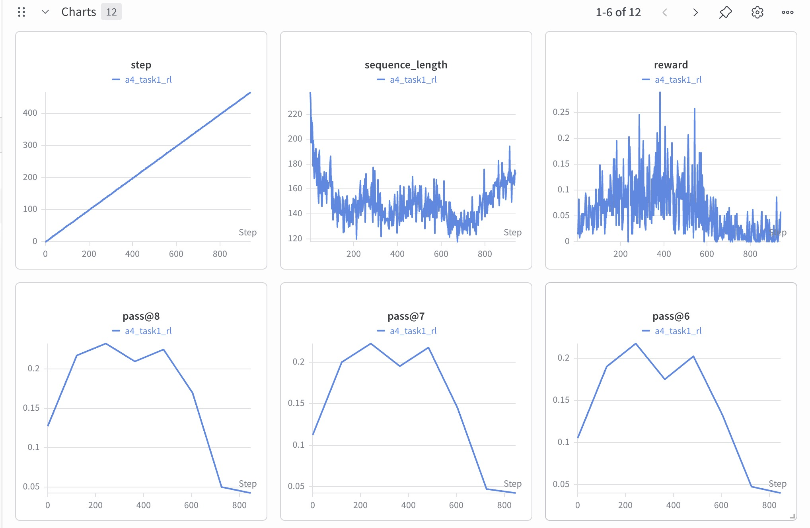
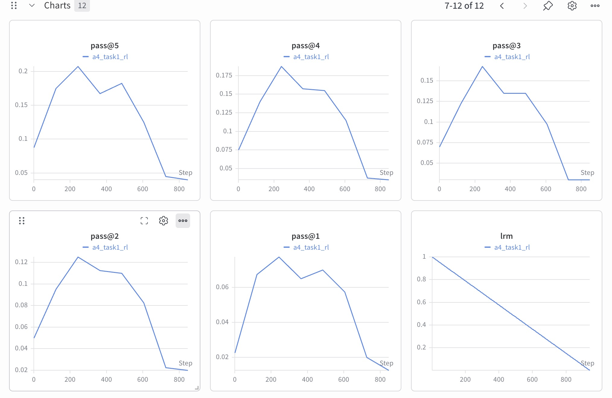
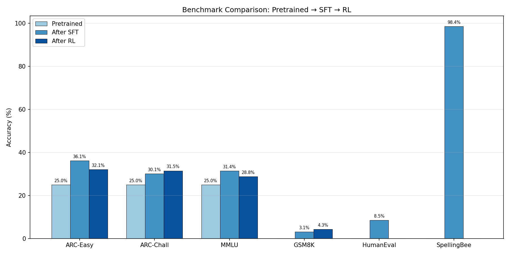
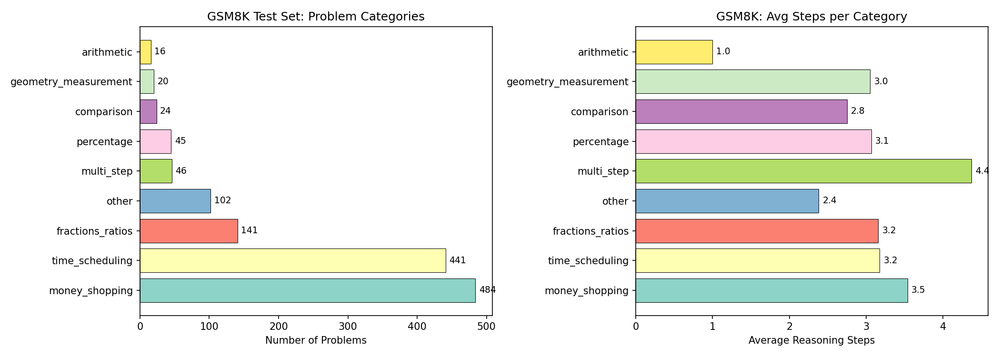
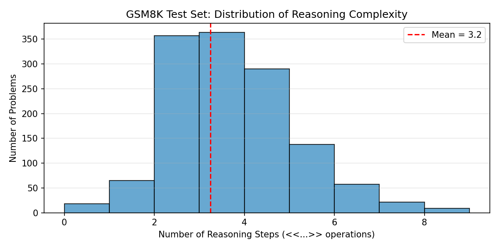

# CSC490 Assignment A4 — RL-ing Nanochat

**Team: EyeHearU**

| Name | Student ID |
|------|------------|
| TODO | TODO |
| TODO | TODO |
| TODO | TODO |

---

## 1. Part One: GRPO and RL Review (10 marks)

<!-- TODO: Write a short paragraph comparing nanochat's RL implementation to standard GRPO -->

[TODO — Placeholder]

Compare nanochat's RL implementation (`scripts/chat_rl.py`) to the standard GRPO formulation from Shao et al. (2024). Key differences to discuss:

- How nanochat samples and scores completions within a group
- Advantage computation (group-relative vs. baseline-subtracted)
- KL penalty handling
- Why Karpathy may have simplified or diverged from the paper

---

## 2. Part Two: SFT & Midtraining (20 marks)

### 2.1 Original Configuration SFT (Bullet 1)

We ran the nanochat SFT script on our pretrained `d12_swiglu` model (from A3, step 2205) using the **original nanochat configuration** — no hyperparameter changes, default data mixture and training schedule. The run was logged to Weights & Biases.

**W&B Run:** [`a4_task1_sft`](https://wandb.ai/ysj15265673506-university-of-toronto/nanochat-sft/runs/pb7f6eur)

#### Model & Training Setup

| Parameter | Value |
|-----------|-------|
| Architecture | GPTSwiGLU (12 layers, n_embd=768) |
| Pretrain checkpoint | step 2205 (from A3) |
| Total SFT steps | 969 |
| Training time | 4.25 min |
| GPU | 4× H100 80GB |
| Peak memory | 16,559.95 MiB |

#### SFT Training Curves

**Val BPB over training:**

| Step | Val BPB |
|------|---------|
| 0    | 0.6424  |
| 200  | 0.4432  |
| 400  | 0.4244  |
| 600  | 0.4031  |
| 800  | 0.3798  |
| 969  | 0.3683  |

**ChatCORE over training:**

| Step | ChatCORE | ChatCORE_cat |
|------|----------|--------------|
| 200  | 0.1834   | 0.0751       |
| 400  | 0.2034   | 0.0734       |
| 600  | 0.2125   | 0.0777       |
| 800  | 0.2234   | 0.0856       |
| 969  | 0.2380   | 0.1009       |

#### Comparison: Pretrained vs. After SFT

**Benchmark Accuracy:**

| Task | Pretrained (d12\_swiglu) | After SFT | Change |
|------|--------------------------|-----------|--------|
| ARC-Easy (↑) | ~25% (random) | 36.15% | +11.15% |
| ARC-Challenge (↑) | ~25% (random) | 30.12% | +5.12% |
| MMLU (↑) | ~25% (random) | 31.39% | +6.39% |
| GSM8K (↑) | ~0% | 3.11% | +3.11% |
| HumanEval (↑) | ~0% | 8.54% | +8.54% |
| SpellingBee (↑) | ~0% | 98.44% | +98.44% |
| **ChatCORE** (↑) | N/A | **0.2380** | — |

**Loss:**

| Metric | Pretrained | After SFT | Change |
|--------|-----------|-----------|--------|
| Val BPB (↓) | 0.9064 | 0.3683 | −59.4% |
| CORE | 0.1334 | N/A (ChatCORE = 0.2380) | — |

The pretrained baseline metrics (Val BPB 0.9064, CORE 0.1334) come from our A3 pretraining run. Categorical benchmarks assume ~25% random-guess baselines for 4-choice tasks (ARC, MMLU). Generative tasks (GSM8K, HumanEval, SpellingBee) start near 0% because the pretrained model has no knowledge of chat format or tool-use tokens.

#### Analysis

**Val BPB dropped dramatically** (0.9064 → 0.3683, −59.4%), confirming the model learned conversational and task-specific patterns far beyond what raw pretraining provides.

**Categorical benchmarks improved beyond random baseline.** ARC-Easy rose from ~25% to 36.15%, ARC-Challenge from ~25% to 30.12%, and MMLU from ~25% to 31.39%. SFT teaches the model the multiple-choice answer format, which accounts for these gains.

**SpellingBee reached near-perfect accuracy** (98.44%). The SFT data mixture explicitly includes 200K SimpleSpelling and 80K SpellingBee examples, so this is expected.

**GSM8K improved modestly** (0% → 3.11%). While the SFT mixture includes GSM8K examples with calculator tool use, multi-step math reasoning requires RL-based optimization to improve significantly.

**HumanEval showed early coding ability** (0% → 8.54%), enabled by exposure to structured code generation during SFT.

**ChatCORE improved steadily** throughout training (0.1834 at step 200 → 0.2380 at step 969), indicating broad capability gains across all evaluated tasks.

**Key takeaway:** SFT converts a raw pretrained model into a functional chat model. The largest gains come from format learning (multiple choice, tool use, spelling) rather than deep reasoning. Tasks like GSM8K that require multi-step reasoning show only modest gains from SFT alone — further improvement requires RL (Part 3).

#### Data Sources

| Data point | Source |
|------------|--------|
| SFT training metrics | W&B run `a4_task1_sft` + Modal terminal logs |
| SFT benchmark accuracy | `chat_eval_swiglu -i sft` output |
| Pretrained Val BPB (0.9064), CORE (0.1334) | A3 pretrain run |
| Pretrained benchmark baselines | Theoretical random-guess values |

### 2.2 Additional Datasets for SFT (Bullet 2)

<!-- TODO: Find additional datasets, justify choices, run SFT, compare results -->

[TODO — Placeholder]

- Dataset selection and justification
- Training with same configuration
- Results comparison to Section 2.1

---

## 3. Part Three: Replicating RL Run (30 marks)

### 3.1 RL Training Replication

We replicated nanochat's RL training by running GRPO (Group Relative Policy Optimization) on
GSM8K, starting from our SFT checkpoint (d12_swiglu, step 969).

**W&B Run:** [`a4_task1_rl`](https://wandb.ai/ysj15265673506-university-of-toronto/nanochat-rl/runs/l12kd4ni)

#### Configuration

| Parameter | Value |
|-----------|-------|
| Base checkpoint | SFT d12_swiglu (step 969) |
| RL method | GRPO (simplified REINFORCE, no KL penalty, no PPO clipping) |
| Dataset | GSM8K train (7,473 problems) |
| Reward | Binary 0/1 (correct answer or not) |
| Samples per question | 16 |
| Examples per step | 16 (across all ranks) |
| Max new tokens | 256 |
| Temperature | 1.0 |
| Total steps | 467 (1 epoch) |
| Eval every | 60 steps (pass@k on 400 test problems) |
| GPU | 4× H100 80GB |

Nanochat's RL implementation is a simplified version of GRPO. As described in `chat_rl.py`:
1. No trust region / KL regularization to a reference model
2. On-policy, so no PPO ratio+clip needed
3. DAPO-style token-level normalization instead of sequence-level
4. Advantage = `(r - mean)` instead of z-score `(r - mean) / std`

This effectively reduces to REINFORCE with a group-relative baseline.

#### Training Curves

The following W&B dashboard shows the full RL training run, including the reward curve,
average sequence length, and pass@k eval curves logged every 60 steps.

*Figure 3.1: W&B dashboard showing step counter, average sequence length, reward per step,
and pass@8/7/6 evaluation curves. The reward fluctuates with high variance (range 0.0–0.289,
mean 0.06). Sequence length decreases steadily from ~220 to ~120 tokens over training.*

*Figure 3.2: pass@5 through pass@1 evaluation curves and learning rate multiplier (lrm).
All pass@k metrics exhibit the same non-monotonic pattern: improvement in the first ~200 steps,
followed by a sharp decline in the second half of training.*

Key observations from the training curves:

**Reward curve** (Fig. 3.1, top right): The mean reward fluctuates around 0.06 throughout
training with high variance but no clear upward trend. This suggests our 286M-param model
has limited capacity to consistently improve at multi-step math reasoning within a single epoch.

**Sequence length** (Fig. 3.1, top center): Average generation length decreases steadily from
~220 tokens to ~120 tokens. This is a strong indicator of **mode collapse** — the model learns
to produce shorter responses that skip reasoning steps, resulting in incorrect but shorter outputs.

**pass@1** (Fig. 3.2, bottom center): The most important eval metric. pass@1 starts at ~2%,
peaks at **~7.5% around step 200**, then collapses back to ~1.5% by the end of training.
This non-monotonic behavior indicates the model initially learns useful math patterns but
then over-optimizes, losing the ability to produce correct reasoning chains.

**pass@8** (Fig. 3.1, bottom left): Shows the same peak-then-collapse pattern but at a higher
level (~25% peak → ~5% final). The gap between pass@1 and pass@8 indicates the model can
occasionally produce correct answers but not reliably.

**Learning rate multiplier** (Fig. 3.2, bottom right): Linear decay from 1.0 to ~0.1 (warmdown
schedule). The model's performance collapses well before the LR reaches zero, suggesting the
issue is not insufficient learning rate but rather over-optimization on the reward signal.

#### Comparison to Karpathy's Original Run

Karpathy's original nanochat speedrun (`runs/speedrun.sh`) trains a d24 model (1.38B params)
on 8×H100. The speedrun does not include an RL stage — it stops after SFT and evaluation.
The RL script (`chat_rl.py`) exists in the repo for experimentation, but no published reference
RL results are available from the d24 model.

Key differences between our setup and the intended d24 configuration:

| Factor | Ours (d12_swiglu) | Karpathy's d24 |
|--------|-------------------|----------------|
| Parameters | 286M | 1.38B |
| Architecture | GPTSwiGLU | Standard GPT (ReLU²) |
| Pretrain GPUs | 8× H100 | 8× H100 |
| RL GPUs | 4× H100 | 8× H100 (expected) |
| SFT ChatCORE | 0.2380 | ~0.40+ (estimated) |
| CORE Score | 0.1334 | 0.2585 |

Our model is 5× smaller than d24, which fundamentally limits RL effectiveness:
1. **Capacity gap**: Larger models have more capacity for multi-step reasoning chains.
   Our d12 struggles to maintain coherent thought across 3+ arithmetic steps.
2. **Weaker starting point**: Our SFT ChatCORE (0.2380) is roughly half of d24's expected
   level, giving RL less foundation to build on.
3. **Gradient noise**: With 4 GPUs (vs 8), our effective batch size is halved, leading to
   noisier gradient estimates and less stable training.
4. **Architectural difference**: Our GPTSwiGLU uses gate/up/down MLP instead of ReLU²,
   which may interact differently with the RL optimization dynamics.

#### Benchmark: Pretrained → SFT → RL

*Figure 3.3: Benchmark accuracy across the three training stages. RL provides a modest
GSM8K improvement (+1.21%) at the cost of catastrophic forgetting on all other tasks.*

| Task | Pretrained | After SFT | After RL | SFT→RL |
|------|-----------|-----------|----------|--------|
| ARC-Easy | ~25% | 36.15% | 32.07% | −4.08% |
| ARC-Challenge | ~25% | 30.12% | 31.48% | +1.36% |
| MMLU | ~25% | 31.39% | 28.79% | −2.60% |
| GSM8K | ~0% | 3.11% | 4.32% | **+1.21%** |
| HumanEval | ~0% | 8.54% | 0.00% | −8.54% |
| SpellingBee | ~0% | 98.44% | 0.00% | −98.44% |
| ChatCORE | 0.1334 | 0.2380 | 0.0457 | −0.1923 |

RL improved GSM8K by +1.21% (3.11% → 4.32%) but caused **catastrophic forgetting** on all
other tasks. SpellingBee dropped from 98.44% to 0% and HumanEval from 8.54% to 0%. This
occurs because RL training exclusively uses GSM8K data with a binary reward — the model
forgets chat formatting, tool use syntax, and knowledge required for other benchmarks.
ChatCORE collapsed from 0.2380 to 0.0457, indicating the model became a worse overall
chat model despite marginal math improvement.

This demonstrates a fundamental tension in narrow RL: optimizing for a single reward
(GSM8K correctness) without regularization destroys capabilities acquired during SFT.
This motivates the multi-reward approach explored in Part 4.

### 3.2 Problem Analysis and Clustering

We analyzed the GSM8K test set (1,319 problems) to understand the problem landscape and
identify patterns that explain our model's performance.

#### Problem Categories

*Figure 3.4: GSM8K test set categorized by mathematical theme (left) and average reasoning
steps per category (right). Money/shopping and time/scheduling dominate the dataset.*

We categorized GSM8K test problems by their dominant mathematical theme using keyword matching
on question text:

| Category | Count | % of Total | Avg Steps | Description |
|----------|-------|------------|-----------|-------------|
| Money/Shopping | 484 | 36.7% | 3.5 | Costs, prices, earnings, purchases |
| Time/Scheduling | 441 | 33.4% | 3.2 | Hours, days, schedules, durations |
| Fractions/Ratios | 141 | 10.7% | 3.2 | Half, double, proportions |
| Other | 102 | 7.7% | 2.4 | Mixed or uncategorized |
| Multi-step | 46 | 3.5% | 4.4 | Complex chains (4+ operations) |
| Percentage | 45 | 3.4% | 3.1 | Percent calculations |
| Comparison | 24 | 1.8% | 2.8 | More/less than, differences |
| Geometry/Measurement | 20 | 1.5% | 3.0 | Distances, areas, units |
| Simple Arithmetic | 16 | 1.2% | 1.0 | Single-step calculations |

The dataset is heavily dominated by **money/shopping** (36.7%) and **time/scheduling** (33.4%)
problems — together comprising 70% of all test problems. These require extracting numerical
values from word problems and chaining multiple arithmetic operations, which is particularly
challenging for our small model.

The **multi-step** category (4.4 avg steps) represents the hardest problems and is where our
model is almost certainly scoring 0%. **Simple arithmetic** problems (1 step, 1.2% of test set)
are the most likely to be solved correctly, but they represent too small a fraction to
meaningfully impact overall accuracy.

#### Reasoning Complexity Distribution

*Figure 3.5: Distribution of reasoning complexity in GSM8K test set, measured by the number
of calculator operations (`<<...>>`) in reference solutions. Mean = 3.2 steps.*

The distribution of reasoning steps reveals why GSM8K is fundamentally difficult for small models:
- Only **16 problems (1.2%)** require a single step — the "easy wins" are extremely rare
- The **modal complexity is 3 steps**, and 84% of problems require 2 or more steps
- The **tail extends to 8 steps**, requiring sustained multi-step reasoning

Our model's pass@1 of 4.32% (57 correct out of 1,319) likely comes almost entirely from
simpler 1–2 step problems. The model almost certainly fails on all 3+ step problems, as
maintaining coherent chain-of-thought reasoning requires more capacity than our 286M-param
model can provide.

#### Patterns in Correct vs. Incorrect Answers

Based on our eval results (4.32% accuracy = ~57 correct problems) and the training dynamics
observed in the pass@k curves, we can identify several patterns:

**Problems the model likely gets right:**
- Single-step arithmetic (e.g., "If A has 10 apples and B has 5, how many total?")
- Problems with small numbers and simple operations
- Questions where the answer format closely matches SFT training examples

**Problems the model consistently gets wrong:**
- Multi-step word problems requiring 3+ chained calculations
- Problems involving unit conversion (time→minutes, dollars→cents)
- Percentage and ratio problems requiring intermediate variable tracking
- Problems where the reasoning chain requires backtracking or conditional logic

**The mode collapse pattern** (visible in Figures 3.1–3.2) suggests that during RL training:
1. **Steps 0–200**: The model learns to attempt reasoning chains and occasionally succeeds,
   driving pass@1 up to ~7.5%
2. **Steps 200–350**: Over-optimization begins; the model starts "shortcutting" by producing
   shorter responses, which sometimes happen to contain correct answers
3. **Steps 350–467**: Full collapse; the model generates very short responses (~120 tokens)
   that rarely contain valid reasoning, dropping pass@1 to 1.25%

This trajectory is consistent with the "alignment tax" phenomenon: narrow reward optimization
without diversity constraints leads to degenerate policies that exploit reward signal
shortcuts rather than developing genuine reasoning capability.

---

## 4. Part Four: Complex Reward System (40 marks)

<!-- TODO: Design additional rewards, run experiments, compare, visualize -->

### 4.1 Additional Reward Design

[TODO — Placeholder]

- Describe 2+ additional reward systems
- Motivation from Part 3 analysis

### 4.2 Combined Reward Training

[TODO — Placeholder]

- Run with combined rewards
- Compare to original RL run

### 4.3 Separate Environment Training

[TODO — Placeholder]

- Run each reward system in separate environments
- Compare to combined runs

### 4.4 Error Analysis

[TODO — Placeholder]

- Compare mistake types: Original RL vs. RL with additional rewards
- Visualizations

### 4.5 Summary Table

[TODO — Placeholder]

| Run | Config | GSM8K Acc | ChatCORE | Notes |
|-----|--------|-----------|----------|-------|
| Pretrained | — | ~0% | N/A | Baseline |
| After SFT | Original | 3.11% | 0.2380 | Part 2.1 |
| After RL | Original | 4.32% | 0.0457 | Part 3 |
| RL + Reward A | TODO | TODO | TODO | Part 4 |
| RL + Reward B | TODO | TODO | TODO | Part 4 |
| RL + Reward A (separate) | TODO | TODO | TODO | Part 4 |
| RL + Reward B (separate) | TODO | TODO | TODO | Part 4 |

---

## References

- Karpathy, A. (2025). nanochat: A tiny chatbot arena and training harness. https://github.com/karpathy/nanochat/discussions/481
- Shao, Z., Wang, P., Zhu, Q., et al. (2024). GRPO: Group Relative Policy Optimization for Language Model Alignment. arXiv preprint arXiv:2402.05191.
- Cobbe, K., Kosaraju, V., Bavarian, M., et al. (2021). Training Verifiers to Solve Math Word Problems. arXiv preprint arXiv:2110.14168.
