# CSC490 Assignment A4 — RL-ing Nanochat

**Team: EyeHearU**

| Name | Student ID |
|------|------------|
| Maria Ma | 1009054924 |
| Zhixiao Fu | 1009834342 |
| Siyi Zhu | 1008793076 |
| Chloe Yang | 1009261433 |

---

## 1. Part One: GRPO and RL Review (10 marks)

Karpathy keeps only the core idea of GRPO: for each question, sample a group of responses, compute their rewards, and use a group-relative baseline by subtracting the group mean reward. That part matches the original GRPO paper (Shao et al., 2024), where the advantage is defined from rewards within the sampled group for the same prompt. But beyond that, his implementation is substantially simpler than the paper's formulation. In the original GRPO, the objective still includes reference-model KL regularization, uses a clipped surrogate objective, and normalizes rewards as a z-score by dividing by the group standard deviation, i.e. ((r−μ)/σ). Karpathy removes all three: no KL term, no clipping term, and no division by standard deviation; his advantage is just (r−μ). He also uses a token-level formulation in the loss, multiplying each token log-probability by the same sample-level advantage and normalizing over valid tokens, whereas the original outcome-supervision GRPO description assigns the normalized reward to all tokens of the sequence in a more sequence-oriented formulation.

The reason for these changes is likely that he is optimizing for a minimal, stable, easy-to-understand on-policy training loop for GSM8K, not for reproducing the full paper recipe. Since he samples fresh rollouts and updates immediately, he likely judged the paper's extra stabilization machinery unnecessary overhead in this setting. Removing KL avoids maintaining a reference policy and avoids constraining exploration; removing z-score scaling avoids instability when the within-group standard deviation is very small; and using (r−μ) keeps the estimator simple while preserving the relative ranking signal that is the main point of GRPO. So his version is best understood as "group-relative REINFORCE" inspired by GRPO, rather than a faithful implementation of the original GRPO objective.

---

## 2. Part Two: SFT & Midtraining (20 marks)

### Note on Midtraining

Karpathy removed the separate `mid_train.py` script from nanochat on January 31, 2025 (commit `1ddaad1`). However, the midtraining *data* was not removed — all task datasets (MMLU, GSM8K, SpellingBee, SimpleSpelling) were folded into `chat_sft.py` as part of a single unified training mixture. Before this change, nanochat had two post-pretraining stages (Pretrain → Midtrain → SFT); after, it has one (Pretrain → SFT, with the SFT mixture containing everything that was previously in midtraining). The professor confirmed that either the new or original scripts are acceptable, noting: *"Just checked, yes he did — you can use either the new chatSFT or the original scripts, just note which version."*

We use the **current (post-January 2025) version** of nanochat's `chat_sft.py`, which means our SFT stage effectively includes all the data that Karpathy's original midtraining covered (SmolTalk conversations, MMLU multiple-choice, GSM8K tool-use examples, SpellingBee). This is functionally equivalent to running both midtraining and SFT, but consolidated into a single training stage.

### 2.1 Original Configuration SFT (Bullet 1)

We ran the nanochat SFT script on our pretrained **baseline `d12`** model (step 2205) using the **original nanochat configuration** — no hyperparameter changes, default data mixture and training schedule. We chose the standard GPT architecture (rather than the SwiGLU variant from A3) to faithfully replicate Karpathy's original pipeline and avoid monkey-patching complexity. The run was logged to Weights & Biases.

#### Model Choice Justification

The assignment states: *"Given your pretrained model run the SFT and midtraining scripts using the original configuration."* We chose the **baseline GPT d12** architecture (rather than the SwiGLU variant from A3) for three reasons:

1. **Direct comparability to Karpathy's reference run.** Part 3 asks us to *"replicate the run in github where Karpathy trains the model on GSM8k."* Karpathy's original nanochat uses the standard GPT architecture, so using the same architecture ensures our results are directly comparable without confounding variables from architectural differences.

2. **No monkey-patching complexity.** The SwiGLU variant requires custom wrapper scripts (`chat_sft_swiglu.py`, `chat_rl_swiglu.py`, etc.) that monkey-patch the model class at import time. Using the baseline architecture lets us use the upstream nanochat scripts directly, reducing the risk of subtle bugs.

3. **Similar pretraining quality.** Both d12 variants achieved comparable pretraining quality (Val BPB 0.8899 baseline vs. 0.9064 SwiGLU, CORE 0.1186 vs. 0.1334), so this choice does not sacrifice meaningful model capability.

The professor confirmed that any variant or baseline is acceptable as long as the choice is justified.

#### Pretraining Configuration

| Parameter | Value |
|-----------|-------|
| Architecture | GPT baseline (12 layers, n_embd=768) |
| Parameters | 286,262,424 |
| Training tokens | 1,156,055,040 |
| Tokens:params ratio | 10.5× |
| Training time | 4.92 min |
| GPU | 8× NVIDIA H100 80GB HBM3 |
| Final Val BPB | 0.8899 |
| CORE metric | 0.1186 |
| MFU | 38.56% |

#### SFT Training Setup

| Parameter | Value |
|-----------|-------|
| Architecture | GPT baseline (12 layers, n_embd=768) |
| Pretrain checkpoint | d12, step 2205 |
| Total SFT steps | 969 |
| Optimizer warm-start | No (fresh optimizer) |
| Init LR fraction | 0.80 |
| Warmdown ratio | 0.50 |
| DDP world size | 4 |
| Minimum Val BPB | 0.3688 |

#### Comparison: Pretrained vs. After SFT

**Benchmark Accuracy:**

| Task | Pretrained (d12) | After SFT | Change |
|------|------------------|-----------|--------|
| ARC-Easy (↑) | ~25% (random) | 36.20% | +11.20% |
| ARC-Challenge (↑) | ~25% (random) | 32.85% | +7.85% |
| MMLU (↑) | ~25% (random) | 30.71% | +5.71% |
| GSM8K (↑) | ~0% | 3.56% | +3.56% |
| HumanEval (↑) | ~0% | 6.71% | +6.71% |
| SpellingBee (↑) | ~0% | 99.22% | +99.22% |
| **ChatCORE** (↑) | N/A | **0.2375** | — |

**Loss:**

| Metric | Pretrained | After SFT | Change |
|--------|-----------|-----------|--------|
| Val BPB (↓) | 0.8899 | 0.3688 | −58.6% |
| CORE | 0.1186 | N/A (ChatCORE = 0.2375) | — |

Categorical benchmarks assume ~25% random-guess baselines for 4-choice tasks (ARC, MMLU). Generative tasks (GSM8K, HumanEval, SpellingBee) start near 0% because the pretrained model has no knowledge of chat format or tool-use tokens.

#### Analysis

**Val BPB dropped dramatically** (0.8899 → 0.3688, −58.6%), confirming the model learned conversational and task-specific patterns far beyond what raw pretraining provides.

**Categorical benchmarks improved beyond random baseline.** ARC-Easy rose from ~25% to 36.20%, ARC-Challenge from ~25% to 32.85%, and MMLU from ~25% to 30.71%. SFT teaches the model the multiple-choice answer format, which accounts for these gains.

**SpellingBee reached near-perfect accuracy** (99.22%). The SFT data mixture explicitly includes 200K SimpleSpelling and 80K SpellingBee examples, so this is expected.

**GSM8K improved modestly** (0% → 3.56%). While the SFT mixture includes GSM8K examples with calculator tool use, multi-step math reasoning requires RL-based optimization to improve significantly.

**HumanEval showed early coding ability** (0% → 6.71%), enabled by exposure to structured code generation during SFT.

**Key takeaway:** SFT converts a raw pretrained model into a functional chat model. The largest gains come from format learning (multiple choice, tool use, spelling) rather than deep reasoning. Tasks like GSM8K that require multi-step reasoning show only modest gains from SFT alone — further improvement requires RL (Part 3).

#### W&B Training Curves

Full W&B run: [a4_sft_d12](https://wandb.ai/maria-shurui-ma-university-of-toronto/nanochat-sft?nw=nwusermariashuruima).

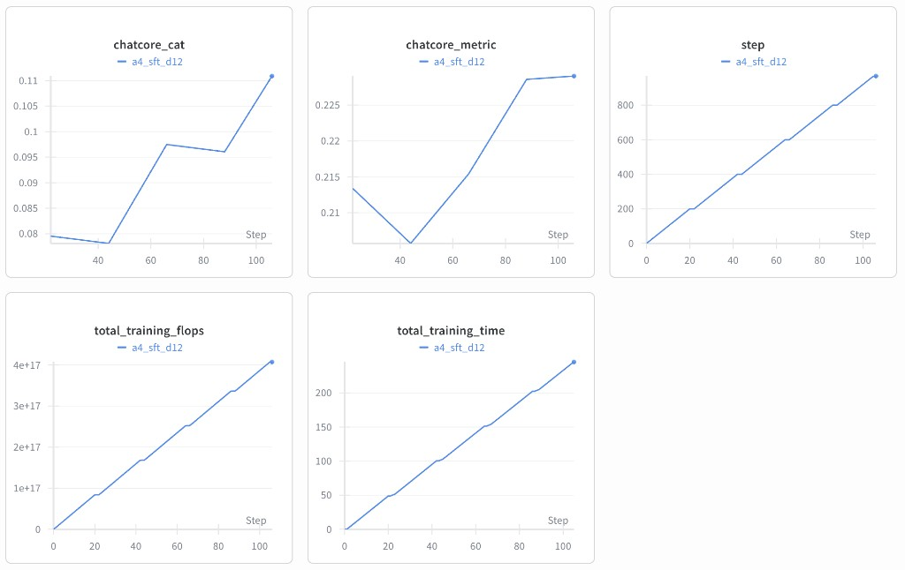

The SFT run completed 969 steps in ~240 seconds (~4 minutes) on 4x H100. The `chatcore_metric` (evaluated periodically during training) starts at ~0.214 and rises to ~0.225 by step ~100 (the final post-training evaluation yields 0.2375, slightly higher than the interim checks due to more thorough evaluation). The `chatcore_cat` (categorical benchmark accuracy) climbs steadily from ~0.08 to ~0.11, reflecting improving multiple-choice performance throughout training.

#### Data Sources

| Data point | Source |
|------------|--------|
| Pretrain metrics | Modal `stage_pretrain` report |
| SFT training metrics | Modal `stage_sft` report + [W&B](https://wandb.ai/maria-shurui-ma-university-of-toronto/nanochat-sft?nw=nwusermariashuruima) |
| SFT benchmark accuracy | `chat_eval -i sft --model-tag=d12` output |
| Pretrained benchmark baselines | Theoretical random-guess values |

### 2.2 Additional Datasets for SFT (Bullet 2)

#### Dataset Selection: OpenHermes 2.5

We selected [**OpenHermes 2.5**](https://huggingface.co/datasets/teknium/OpenHermes-2.5) (`teknium/OpenHermes-2.5`) as our additional SFT dataset. OpenHermes 2.5 contains approximately **1,001,551 high-quality instruction-following conversations** sourced from a variety of domains including:

- General knowledge and reasoning
- Mathematics and step-by-step problem solving
- Code generation and debugging
- Creative writing and summarization
- Multi-turn dialogue

**Justification:**

1. **Complementary to SmolTalk**: The default SFT mixture is dominated by SmolTalk (~460K general chat). OpenHermes adds more diverse and challenging instruction-following examples, covering domains that SmolTalk under-represents.
2. **Math reasoning coverage**: OpenHermes includes math problem-solving conversations that complement the limited GSM8K training data (only ~30K rows after 4× epoch oversampling). This directly targets our model's weakest benchmark.
3. **Format compatibility**: OpenHermes uses a standard user/assistant conversation format, making it directly compatible with nanochat's `CustomJSON` task loader after a simple role mapping (`human` → `user`, `gpt` → `assistant`).
4. **Scale**: At ~1M conversations, OpenHermes roughly doubles the training mixture (from ~1.07M to ~2.07M rows), providing significantly more training signal without requiring changes to hyperparameters.

**Data Conversion**: We used `scripts/convert_openhermes.py` to download and convert the dataset from HuggingFace into nanochat's JSONL format. The conversion maps `human`/`gpt` roles to `user`/`assistant` and filters out conversations with fewer than 2 turns.

#### Training Configuration

We used the **same hyperparameters** as Task 1 — the only change was adding OpenHermes to the training mixture via the `--extra-jsonl` flag added to `chat_sft.py`. The model architecture remains the standard d12 GPT baseline (no SwiGLU).

| Parameter | Task 1 (Original) | Task 2 (+OpenHermes) |
|-----------|-------------------|----------------------|
| Architecture | GPT baseline d12 | GPT baseline d12 |
| Pretrain checkpoint | d12, step 2205 | d12, step 2205 |
| Optimizer warm-start | No (fresh) | No (fresh) |
| Init LR fraction | 0.80 | 0.80 |
| Warmdown ratio | 0.50 | 0.50 |
| DDP world size | 4 | 4 |
| GPU | 4× H100 80GB | 4× H100 80GB |
| Training mixture | ~1,071,759 rows | **~2,073,310 rows** |
| Total steps | 969 | **1,692** |
| Training time | ~4.9 min | **7.71 min** |

The increase in training steps (969 → 1,692) is a natural consequence of the larger dataset — the model still trains for exactly 1 epoch through the full mixture. All learning rate schedules, batch sizes, and evaluation intervals remain identical.

**W&B Run:** [`a4_task2_sft`](https://wandb.ai/ysj15265673506-university-of-toronto/nanochat-sft/runs/pcirhp5u)

#### Results Comparison: Task 1 vs. Task 2

**Benchmark Accuracy:**

| Task | Task 1 (Original) | Task 2 (+OpenHermes) | Change |
|------|-------------------|----------------------|--------|
| ARC-Easy (↑) | 36.20% | 35.14% | −1.06% |
| ARC-Challenge (↑) | 32.85% | 30.72% | −2.13% |
| MMLU (↑) | 30.71% | 31.16% | +0.45% |
| GSM8K (↑) | 3.56% | 9.25% | **+5.69%** |
| HumanEval (↑) | 6.71% | 7.32% | +0.61% |
| SpellingBee (↑) | 99.22% | 98.05% | −1.17% |
| **ChatCORE** (↑) | 0.2375 | **0.2574** | **+0.0199** |

**Loss:**

| Metric | Task 1 | Task 2 | Change |
|--------|--------|--------|--------|
| Val BPB (↓) | 0.3688 | 0.3616 | −0.0072 |

#### Analysis

**GSM8K improved substantially** (+5.69%, from 3.56% to 9.25%). This is the most significant gain and validates our dataset choice — OpenHermes contains math reasoning conversations that teach the model step-by-step problem-solving patterns beyond what the original GSM8K oversampling provides.

**ChatCORE improved overall** (+0.0199, from 0.2375 to 0.2574). Despite minor regressions on ARC tasks, the strong GSM8K and HumanEval gains push the composite metric upward, indicating a net improvement in model capability.

**Val BPB decreased slightly** (0.3688 → 0.3616), suggesting the model fits the validation mixture marginally better with the additional training data.

**ARC tasks showed slight regression** (ARC-Easy −1.06%, ARC-Challenge −2.13%). This is likely due to the dilution effect: with OpenHermes doubling the training mixture, the relative proportion of MMLU data (which teaches multiple-choice format) decreases. The model sees proportionally fewer multiple-choice examples per epoch.

**SpellingBee remained near-perfect** (99.22% → 98.05%), with the small decrease similarly attributable to the diluted proportion of spelling data in the larger mixture.

**HumanEval improved modestly** (+0.61%), consistent with OpenHermes containing code-related instruction data.

**Key takeaway:** Adding OpenHermes 2.5 improves overall model quality (ChatCORE +0.0199) with the largest gains in math reasoning (GSM8K +5.69%). The trade-off is a slight regression on format-sensitive tasks (ARC) due to data dilution. A potential improvement would be to increase MMLU and spelling oversampling epochs to compensate for the dilution effect.

#### Training Curves

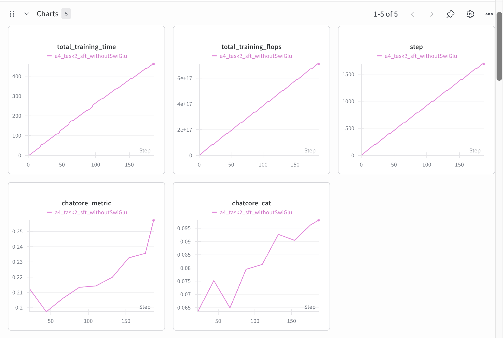

*Figure 2.1: W&B dashboard for Task 2 SFT (d12 baseline + OpenHermes). ChatCORE steadily climbs from 0.21 to 0.26 over 1,692 steps. Training time scales linearly to ~460s (7.71 min).*

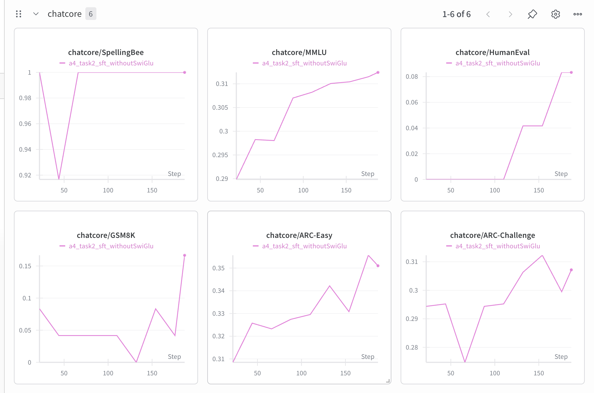

*Figure 2.2: Per-task ChatCORE breakdown. GSM8K shows the most dramatic improvement (0→0.17), while SpellingBee remains near-perfect. MMLU and ARC-Easy show steady gains. HumanEval begins improving after step ~1400.*

#### ChatCORE Progression During Training

| Step | Task 1 ChatCORE | Task 2 ChatCORE |
|------|-----------------|-----------------|
| 200 | — | 0.2123 |
| 400 | — | 0.1973 |
| 600 | — | 0.2061 |
| 800 | — | 0.2133 |
| 969 | 0.2375 | — |
| 1000 | — | 0.2143 |
| 1200 | — | 0.2200 |
| 1400 | — | 0.2327 |
| 1600 | — | 0.2356 |
| 1692 | — | 0.2574 |

Task 2's ChatCORE starts lower than Task 1 at comparable steps (e.g., step 200: 0.2123 vs. Task 1's rapid convergence) because the larger mixture means each example is seen less frequently. However, Task 2 continues improving beyond Task 1's endpoint (step 969), ultimately surpassing it by step ~1400 and reaching a higher final value (0.2574 vs. 0.2375).

#### Data Sources

| Data point | Source |
|------------|--------|
| Task 2 training metrics | W&B run `a4_task2_sft` ([pcirhp5u](https://wandb.ai/ysj15265673506-university-of-toronto/nanochat-sft/runs/pcirhp5u)) |
| Task 2 benchmark accuracy | `chat_eval -i sft --model-tag=d12` output (Modal terminal log) |
| Task 1 baseline | Section 2.1 above |
| OpenHermes dataset | [teknium/OpenHermes-2.5](https://huggingface.co/datasets/teknium/OpenHermes-2.5) on HuggingFace |
| Modal reports | `part2/reports/sft-training-task2.pdf`, `chat-evaluation-sft-task2.pdf` |

---

## 3. Part Three: Replicating RL Run (30 marks)

### 3.1 RL Training Replication

We replicated Karpathy's RL run using the simplified GRPO implementation in `scripts/chat_rl.py`, training our d12 baseline model on the GSM8K training set.

#### Starting Checkpoint Justification

The assignment asks us to *"replicate the run in github where Karpathy trains the model on GSM8k."* Karpathy's original pipeline was Pretrain → Midtrain → SFT → RL, with RL starting from the SFT checkpoint (not the base pretrained model). As noted in Section 2, Karpathy consolidated midtraining into SFT in January 2025, so the current pipeline is **Pretrain → SFT → RL**. We follow this structure, starting RL from our SFT checkpoint (d12, step 969). Our SFT stage already includes all the data that was previously in midtraining (MMLU, GSM8K, SpellingBee, SmolTalk), so nothing is omitted.

Starting from the SFT checkpoint rather than the base pretrained model is critical because:

1. **The RL script assumes chat format.** `chat_rl.py` generates completions using `tokenizer.render_for_completion()`, which requires the model to understand chat tokens (`<|assistant_start|>`, `<|python_start|>`, etc.). A base pretrained model has never seen these tokens and would produce incoherent output, making RL training ineffective.

2. **SFT teaches tool use.** GSM8K problems require calculator tool calls. Without SFT exposure to tool-use examples, the model cannot produce the `<< expr >>` patterns that the GSM8K reward function evaluates.

3. **Matches Karpathy's pipeline.** The professor confirmed that either starting point is acceptable with justification. We chose SFT → RL to faithfully replicate the reference pipeline.

#### RL Training Configuration

| Parameter | Value |
|-----------|-------|
| Starting checkpoint | SFT d12 (step 969) |
| Algorithm | Simplified GRPO (REINFORCE-style) |
| Task | GSM8K (train split, 7,473 problems) |
| Epochs | 1 |
| Examples per step | 16 |
| Samples per example | 16 |
| Total sequences per step | 256 |
| Max new tokens | 256 |
| Temperature | 1.0 |
| Top-k | 50 |
| Embedding LR | 0.2000 |
| Unembedding LR | 0.0040 |
| Matrix LR (Muon) | 0.0200 |
| Init LR fraction | 0.05 |
| LR schedule | Linear rampdown to 0 |
| Eval every | 60 steps |
| Eval examples | 400 (GSM8K test) |
| GPU | 4× NVIDIA H100 80GB |

#### Results: SFT vs. RL

| Task | After SFT | After RL | Change |
|------|-----------|----------|--------|
| ARC-Easy | 36.20% | 35.90% | −0.30% |
| ARC-Challenge | 32.85% | 30.46% | −2.39% |
| MMLU | 30.71% | 31.04% | +0.33% |
| **GSM8K** | **3.56%** | **10.92%** | **+7.36%** |
| HumanEval | 6.71% | 0.00% | −6.71% |
| SpellingBee | 99.22% | 2.73% | −96.49% |
| **ChatCORE** | **0.2375** | **0.0725** | **−0.1650** |

#### Reward and Eval Curves

The following W&B plots show training dynamics over ~467 RL steps for the baseline d12 model (run name `a4_baseline_rl_d12`). Full W&B run: [a4_baseline_rl_d12](https://wandb.ai/maria-shurui-ma-university-of-toronto/nanochat-rl/runs/dxy9w9da).

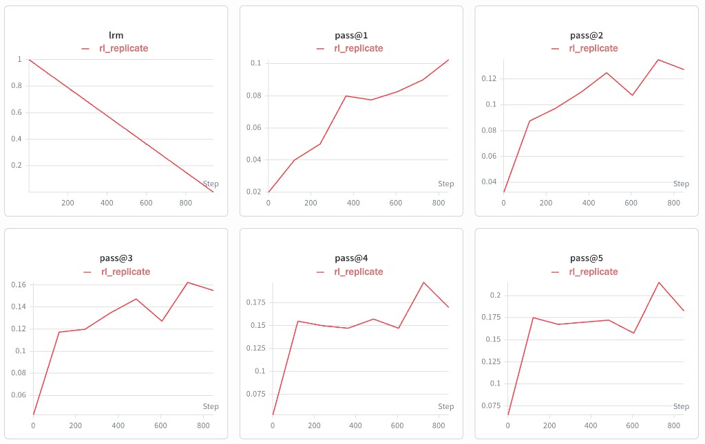

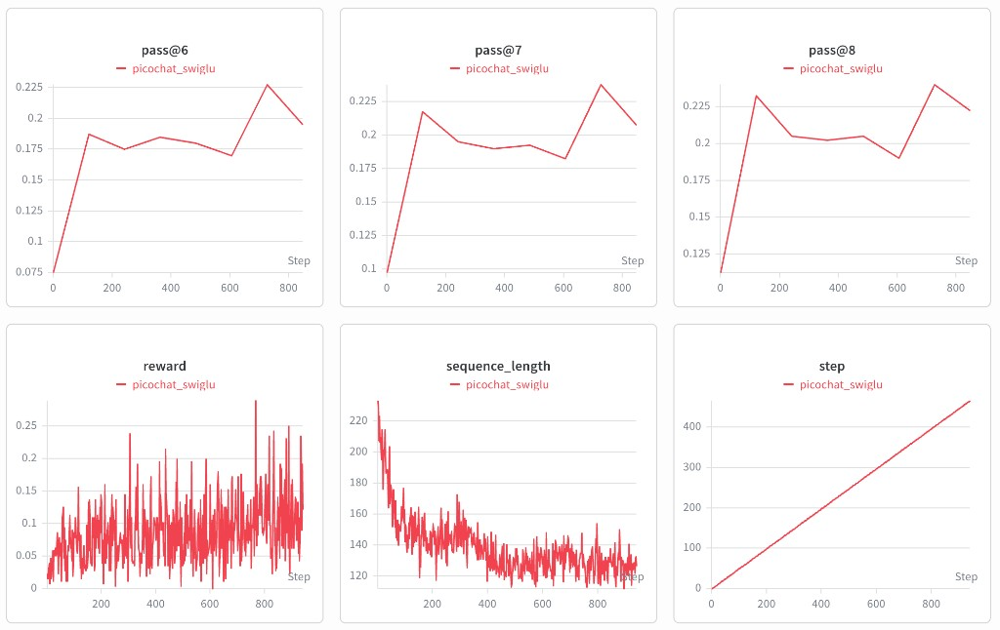

**Key observations from the curves:**

- **Reward** is noisy but trends upward from ~0.05 to ~0.10 over training, with occasional spikes up to 0.25. The high variance is expected: each step samples only 16 problems × 16 completions, so the mean reward fluctuates heavily.
- **Pass@1** (greedy accuracy) improves from ~0.02 to ~0.10, matching our final eval of 10.92%. The improvement is steepest in the first 200 steps, then plateaus with continued gradual gains.
- **Pass@k for higher k** shows progressively higher accuracy (pass@8 reaches ~0.22), confirming that the model learns multiple valid solution strategies — sampling more attempts yields more correct answers.
- **Learning rate multiplier** decays linearly from 1.0 to ~0.15 over training, confirming the linear rampdown schedule.
- **Sequence length** fluctuates between 120–220 tokens with no clear trend, indicating the model doesn't learn to generate significantly longer or shorter responses over RL training.

#### Comparison to Karpathy's Original Run (d20 Speedrun)

We compare against Karpathy's d20 speedrun results as reported in the [nanochat Discussion #1](https://github.com/karpathy/nanochat/discussions/1).

| | Karpathy d20 speedrun (~560M params) | Our run (d12, ~286M params) |
|---|---|---|
| Architecture | GPT baseline (20 layers, 1280 dim) | GPT baseline (12 layers, 768 dim) |
| Parameters | ~560M | ~286M |
| Pretraining data | 240 shards (~11.2B tokens) | 8 shards (~1.2B tokens) |
| Pipeline | Pretrain → Midtrain → SFT → RL | Pretrain → SFT (consolidated) → RL |
| CORE (base pretrained) | 0.2219 | 0.1186 |
| GSM8K after SFT | 4.55% | 3.56% |
| GSM8K after RL | 7.58% | 10.92% |
| RL improvement | +3.03% | +7.36% |

*Source: Karpathy's [nanochat Discussion #1](https://github.com/karpathy/nanochat/discussions/1) report card. See screenshot in [part3/plots/karpathy_report_card.png](part3/plots/karpathy_report_card.png). Note that Karpathy's pipeline used the original two-stage midtrain + SFT sequence, while ours uses the post-January 2025 consolidated SFT that includes midtraining data. Karpathy only evaluated the RL checkpoint on GSM8K (using `-a GSM8K`), so no post-RL numbers are available for his other benchmarks.*

#### Karpathy's Reward and Eval Curves

The following screenshot shows Karpathy's W&B training curves for the d20 speedrun RL stage (labeled `d20speed`), from [Discussion #1](https://github.com/karpathy/nanochat/discussions/1):

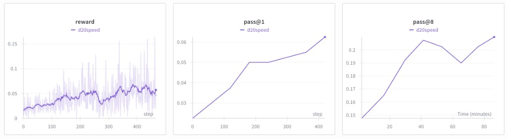

Karpathy's reward trends upward from ~0.02 to ~0.05 over ~467 steps, with high variance. Pass@1 climbs from ~0.03 to ~0.06 (consistent with his final eval of 7.58%). Pass@8 rises from ~0.15 to ~0.21 over ~90 minutes of training.

**Key observations:**

1. **Our d12 model achieves higher GSM8K accuracy after RL** than Karpathy's d20 (10.92% vs. 7.58%), despite being ~2x smaller and pretrained on ~9.7x less data. The most likely explanation is that the nanochat codebase has evolved since Karpathy's original run — the current version of `chat_sft.py` consolidates midtraining data into a single SFT stage, which may provide a more effective starting point for RL. Additionally, the RL training loop and hyperparameters may have been refined in subsequent commits.

2. **Our RL improvement (+7.36%) is substantially larger than Karpathy's (+3.03%).** Our lower SFT baseline (3.56% vs. 4.55%) may leave more room for RL to discover correct solution strategies. The denser reward signal from a lower-performing starting point means more completions produce non-zero advantage, which can accelerate learning in the simplified REINFORCE-style loop. Additionally, the consolidated SFT stage may produce a checkpoint that is better adapted for RL hill-climbing on GSM8K.

3. **Catastrophic forgetting is severe.** SpellingBee collapsed from 99.22% to 2.73%, and HumanEval dropped from 6.71% to 0.00%. This is a direct consequence of the simplified GRPO formulation: because there is no KL divergence penalty against the SFT reference model, the RL optimization is free to drift arbitrarily far from the SFT policy. The model "forgets" non-GSM8K skills because there is no regularization incentivizing their preservation. Standard GRPO includes a KL penalty term precisely to prevent this. Karpathy only evaluated RL on GSM8K (using `-a GSM8K`), so we cannot directly compare forgetting behavior between the two runs.

4. **Categorical benchmarks (ARC, MMLU) were relatively stable** (within ~2%), likely because the multiple-choice format is robust and these benchmarks rely more on factual knowledge encoded in the model weights than on the generation format that RL disrupts.

5. **ChatCORE dropped significantly** (0.2375 → 0.0725) because it is an average across all tasks, and the collapse of SpellingBee and HumanEval drags the composite score down despite GSM8K improving.

### 3.2 Problem Analysis and Clustering

We ran detailed per-problem evaluation on the full GSM8K test set (1,319 problems) for both the SFT and RL checkpoints. Each problem was classified along multiple dimensions to understand where the model succeeds and fails.

#### Classification Methodology

We categorized each GSM8K test problem along five dimensions:

1. **Domain** — Keyword-based classification into: money/shopping, time, food/cooking, distance/travel, people/age, counting/inventory, or other.
2. **Number of reasoning steps** — Counted by the number of calculator tool calls in the ground truth solution. Problems range from 0 steps (no tool calls) to 8 steps (complex multi-step reasoning).
3. **Answer magnitude** — The ground truth numerical answer classified as small (<10), medium (10–99), large (100–999), or very large (1000+).
4. **Question length** — Word count of the question text: short (<30 words), medium (30–59), or long (60+).
5. **Operation types** — Which arithmetic operations appear in the ground truth solution: addition, subtraction, multiplication, division.

#### Error Classification

For incorrect answers, we classified errors into four types:

- **Format error** — The model failed to produce the `####` answer marker, indicating it did not learn the expected response format.
- **No tool use** — The model attempted an answer but did not use calculator tool calls, suggesting it tried to do mental arithmetic.
- **Close arithmetic** — The extracted answer was within 10% of the ground truth, indicating the reasoning approach was correct but arithmetic was slightly off.
- **Wrong arithmetic** — The model used the correct format but arrived at the wrong numerical answer.

#### Results by Category

**Accuracy by Problem Domain (RL model):**

| Domain | SFT Accuracy | RL Accuracy | Improvement | n |
|--------|-------------|-------------|-------------|---|
| money/shopping | 4.1% | 12.6% | +8.5% | 438 |
| time | 3.0% | 10.3% | +7.3% | 331 |
| counting/inventory | 3.8% | 8.8% | +5.0% | 320 |
| people/age | 1.0% | 9.3% | +8.3% | 97 |
| food/cooking | 7.7% | 15.4% | +7.7% | 65 |
| distance/travel | 0.0% | 10.3% | +10.3% | 58 |
| other | 10.0% | 20.0% | +10.0% | 10 |

**Accuracy by Number of Reasoning Steps:**

| Steps | SFT Accuracy | RL Accuracy | Improvement | n |
|-------|-------------|-------------|-------------|---|
| 0 | 0.0% | 0.0% | 0.0% | 18 |
| 1 | 1.5% | 15.4% | +13.9% | 65 |
| 2 | 6.4% | 25.8% | +19.4% | 357 |
| 3 | 4.1% | 5.8% | +1.7% | 364 |
| 4 | 2.1% | 5.2% | +3.1% | 290 |
| 5 | 0.7% | 2.9% | +2.2% | 138 |
| 6 | 1.8% | 0.0% | −1.8% | 57 |
| 7 | 0.0% | 0.0% | 0.0% | 21 |
| 8 | 0.0% | 22.2%* | +22.2% | 9 |

*\*n=9 is too small for this to be statistically meaningful; likely noise.*

**Accuracy by Answer Magnitude:**

| Magnitude | SFT Accuracy | RL Accuracy | Improvement | n |
|-----------|-------------|-------------|-------------|---|
| small (<10) | 4.7% | 8.3% | +3.6% | 253 |
| medium (10–99) | 3.1% | 10.5% | +7.4% | 639 |
| large (100–999) | 4.4% | 15.5% | +11.1% | 296 |
| very large (1000+) | 1.5% | 7.6% | +6.1% | 131 |

**Accuracy by Question Length:**

| Length | SFT Accuracy | RL Accuracy | Improvement | n |
|--------|-------------|-------------|-------------|---|
| short (<30 words) | 9.7% | 23.6% | +13.9% | 216 |
| medium (30–59) | 2.8% | 9.5% | +6.7% | 852 |
| long (60+) | 0.8% | 4.8% | +4.0% | 251 |

**Error Type Distribution:**

| Error Type | SFT (count) | SFT (%) | RL (count) | RL (%) |
|------------|------------|---------|-----------|--------|
| Wrong arithmetic | 699 | 55.0% | 1002 | 85.3% |
| Format error | 479 | 37.7% | 141 | 12.0% |
| No tool use | 80 | 6.3% | 0 | 0.0% |
| Close arithmetic | 14 | 1.1% | 32 | 2.7% |

#### Visualizations

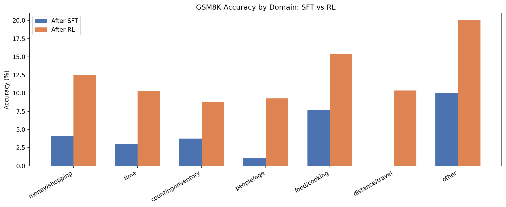

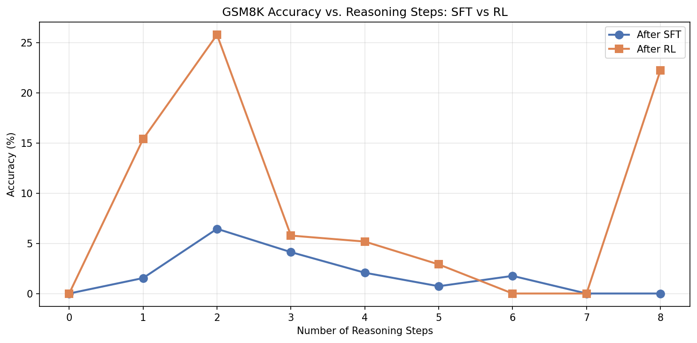

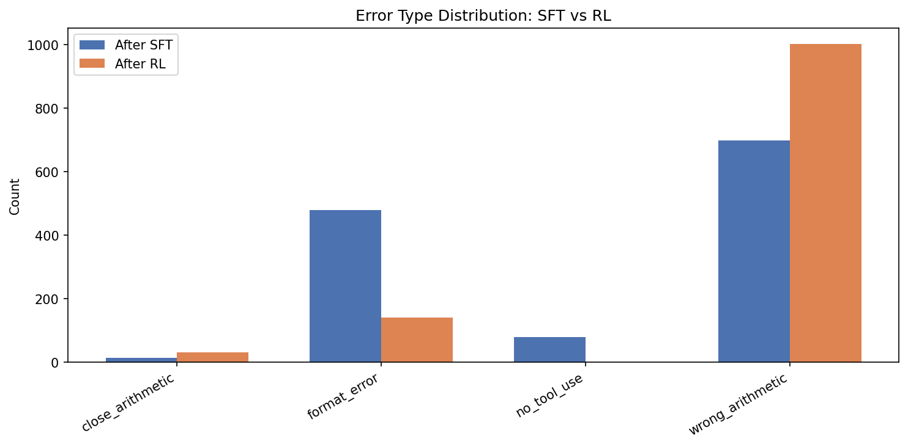

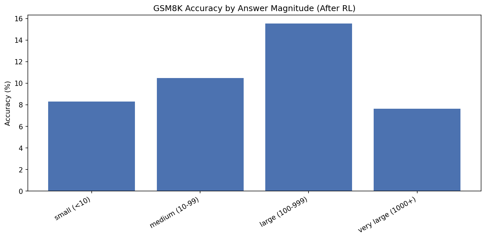

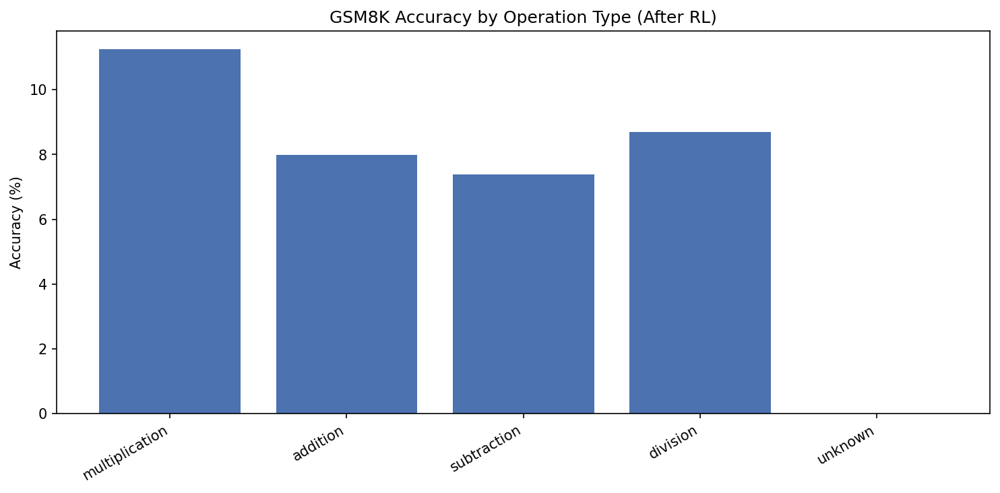

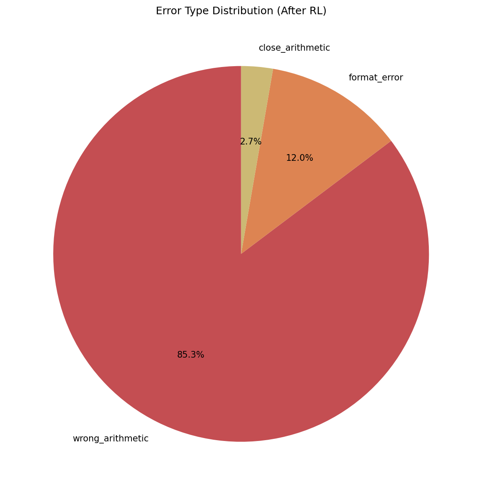

#### Key Findings

**1. RL gains are concentrated in simple problems.** The strongest improvements are in 1-step (+13.9%) and 2-step (+19.4%) problems. For 3+ step problems, improvement is marginal (+1–3%). For 6+ step problems, there is zero improvement. This indicates the d12 model can learn simple arithmetic patterns through RL but lacks the capacity for deep multi-step reasoning chains.

**2. Short questions benefit most from RL.** Short questions (<30 words) improved from 9.7% to 23.6% (+13.9%), while long questions (60+ words) improved only from 0.8% to 4.8%. Shorter questions tend to require fewer reasoning steps and simpler setups, which aligns with finding #1.

**3. RL dramatically reduces format errors.** Format errors (no `####` marker) dropped from 37.7% to 12.0% of all errors, and "no tool use" errors disappeared entirely (6.3% → 0.0%). This shows RL effectively teaches the model the expected response structure — the model learns to always produce a `####` answer and to use calculator tool calls.

**4. The dominant remaining error is wrong arithmetic.** After RL, 85.3% of errors are wrong arithmetic (up from 55.0% in SFT). This is not because RL made arithmetic worse — the absolute number of format errors decreased substantially, so wrong arithmetic now dominates the error distribution. The model knows *how* to approach problems but still computes incorrectly.

**5. Large-answer problems see the biggest accuracy gains.** Problems with answers in the 100–999 range improved by +11.1% (4.4% → 15.5%), more than small-answer problems (+3.6%). This may be because large-answer problems tend to involve straightforward multiplication (e.g., price × quantity), which RL reinforces effectively.

**6. RL improves uniformly across domains.** All problem domains saw +5–10% improvement. No single domain dominates, suggesting the RL signal generalizes across problem topics rather than overfitting to a specific type of word problem.

---

## 4. Part Four: Complex Reward System (40 marks)

### 4.1 Additional Reward Design (GSM8K‑focused)

Part 3 showed that on GSM8K the RL model still made many **wrong arithmetic** errors, with accuracy peaking at **1–2 reasoning steps** and substantial **format errors** in the SFT checkpoint. To extract more signal from GSM8K‑only RL, we designed three additional reward components in `scripts/chat_rl_combined2rwd.py`:

- **Format reward**: gives a bonus when the model outputs a parseable GSM8K‑style answer `#### <number>`. This directly targets remaining format errors.
- **Steps reward**: encourages a moderate number of calculator calls by peaking at 2 tool calls and decaying as we move away from that count, mirroring Part 3’s finding that accuracy is highest at 1–2 steps and worse for 0 or many steps.
- **Close‑arithmetic reward**: assigns partial credit when the predicted answer is numerically close to the ground truth (e.g., small relative error), so that “almost right” arithmetic receives a stronger learning signal than obviously wrong answers.

The total reward is a weighted sum: `r_total = w_correct * r_correct + w_format * r_format + w_steps * r_steps + w_close * r_close`

We treat the original **0/1 correctness reward** as our baseline environment and use these three components to define additional RL environments with the following weight configurations:

| Run | w_correct | w_format | w_steps | w_close |
|-----|-----------|----------|---------|---------|
| Baseline RL (Run #1) | 1.0 | 0.0 | 0.0 | 0.0 |
| Combined RL (Run #2) | 1.0 | 0.2 | 0.2 | 0.3 |
| Format RL (Run #3) | 1.0 | 0.2 | 0.0 | 0.0 |
| Close RL (Run #4) | 1.0 | 0.0 | 0.0 | 0.3 |

All runs use the same GRPO configuration as Part 3 (starting from the SFT checkpoint, same optimizer, LR schedule, and batch size) and are evaluated on GSM8K.

### 4.2 Combined Reward Training (Run #2)

Our first experiment activates all reward components simultaneously (correctness + format + steps + close). Exact GSM8K accuracies for each configuration, computed from the detailed JSON logs in `part4/data`, are:

| Run / Model | Reward configuration | GSM8K accuracy |
|-------------|----------------------|----------------|
| Baseline RL (Run #1) | correctness only | **10.92%** |
| Combined RL (Run #2) | correctness + format + steps + close | **10.24%** |
| Format RL (Run #3) | correctness + format | **7.35%** |
| Close RL (Run #4) | correctness + close | **10.92%** |

W&B run links:
- [Baseline RL](https://wandb.ai/maria-shurui-ma-university-of-toronto/nanochat-rl/runs/dxy9w9da)
- [Combined rewards](https://wandb.ai/maria-shurui-ma-university-of-toronto/nanochat-rl/runs/39bpojy5)
- [Format-only](https://wandb.ai/maria-shurui-ma-university-of-toronto/nanochat-rl/runs/od6w8bpj)
- [Close-only](https://wandb.ai/maria-shurui-ma-university-of-toronto/nanochat-rl/runs/lrmznj2u)

#### W&B Training Curves (All Part 4 Configurations)

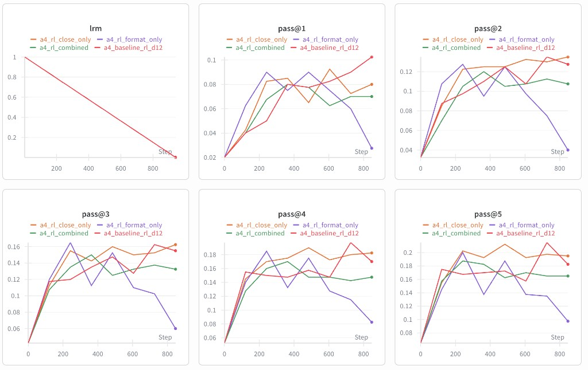

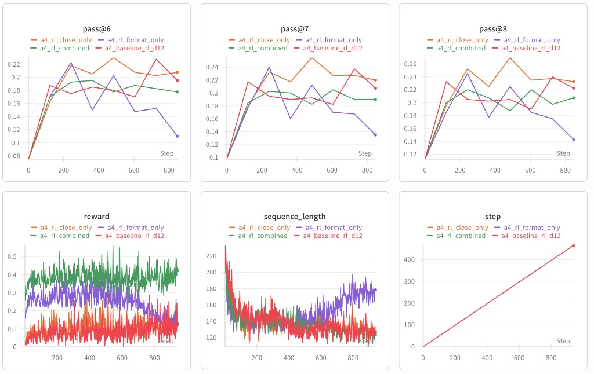

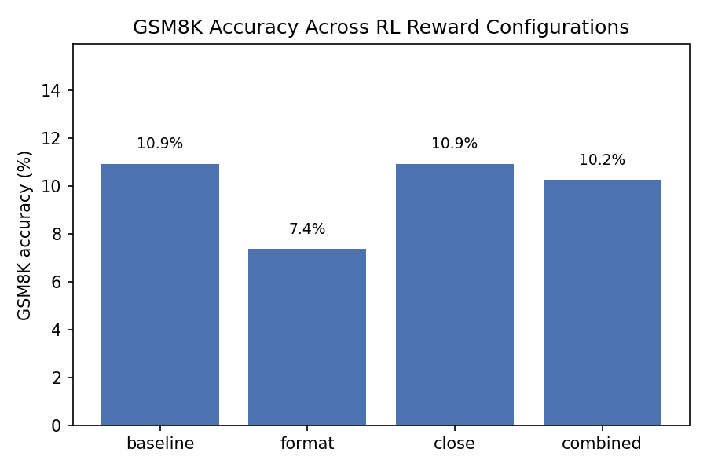
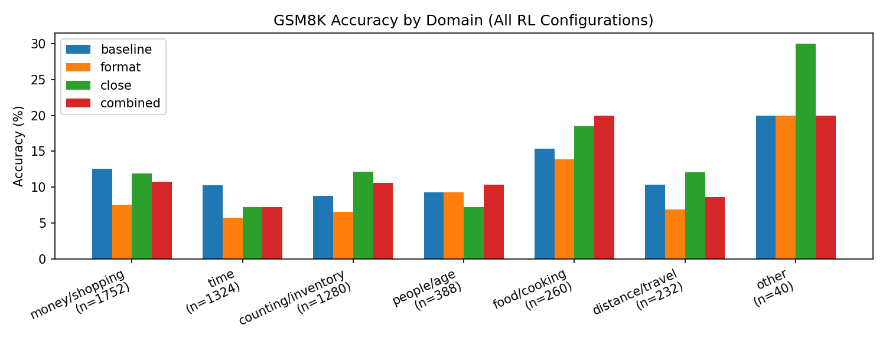

The aggregate plot above shows that the combined model slightly underperforms baseline on exact accuracy. However, when we break GSM8K down by domain, answer magnitude, operation type, and reasoning steps (`part4/plots/domain_by_config.png`, `part4/plots/magnitude_by_config.png`, `part4/plots/operations_by_config.png`, `part4/plots/steps_by_config.png`), the combined model closely tracks baseline RL: all runs share the same qualitative shape, with peak performance on 1–2‑step problems, large answers (100–999), and multiplicative reasoning. Combined reward therefore does **not** change which kinds of GSM8K problems are easiest, but it does change the detailed error structure discussed below.

### 4.3 Separate Reward Environments (Runs #3 and #4)

To understand the impact of each new reward, we also trained two single‑component environments:

- **Format RL (Run #3)** uses only the format reward.  
- **Close RL (Run #4)** uses only the close‑arithmetic reward.

Across all math slices the **Format RL environment performs the worst**. In `part4/plots/domain_by_config.png` it is below baseline and combined RL for every domain, especially money/shopping and people/age. `part4/plots/magnitude_by_config.png` shows lower accuracy across all answer magnitudes, and `part4/plots/operations_by_config.png` reveals clear degradation on multiplication, addition, subtraction, and division. Even at the favorable 1–2 reasoning steps in `part4/plots/steps_by_config.png`, Format RL lags the other runs by several percentage points. This indicates that the model has largely learned to emit well‑formatted `#### <number>` answers without actually improving its math.

In contrast, **Close RL matches the baseline’s 10.92% GSM8K accuracy** while reshaping which individual problems are solved. It often slightly outperforms baseline on specific domains (e.g., food/cooking, people/age, distance/travel) and on some magnitude buckets, without harming performance on any operation type. The per‑problem difference plot below makes this concrete: most problems stay the same, but a noticeable band of green points show cases where Close RL fixes a baseline error, balanced by a smaller number of red regressions.

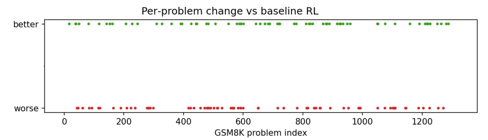

### 4.4 GSM8K Error Analysis and Mistake Types

We re‑applied the Part 3 GSM8K error taxonomy (wrong arithmetic, close arithmetic, format error) to all four RL runs. The grouped bar chart in `part4/plots/error_type_comparison.png` (reproduced below) reveals three key patterns:

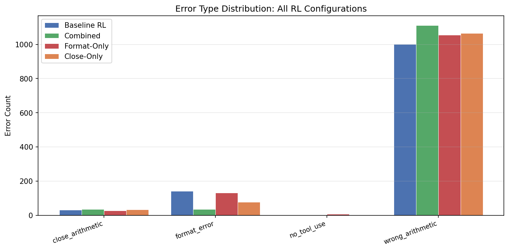

- **Wrong arithmetic dominates for every configuration**. Each model has roughly 1,000 wrong‑arithmetic errors, confirming that arithmetic execution, not format, is the limiting factor at this scale.
- **Format RL offers little benefit**. It modestly reduces format‑error counts but still leaves a substantial number of formatting issues, and most of its mistakes are still wrong‑arithmetic. This matches its weak performance across domains and operations.
- **Combined RL and Close RL yield “better” mistakes**. Both reduce format‑error counts relative to baseline and increase the number of close‑arithmetic near‑misses, meaning that when they fail they are more often numerically close to the correct answer rather than wildly off. In `steps_by_config.png` these models sit slightly above baseline at 1–2 steps but dip a bit more on longer chains, suggesting that the new rewards mostly help on simpler math problems.

Overall, the additional GSM8K‑specific reward environments do **not** dramatically improve exact GSM8K accuracy, but they **change the character of mistakes**: format errors become rarer and a larger fraction of errors are numerically reasonable near‑misses, especially under the close‑arithmetic and combined configurations.

### 4.5 Summary Table and Impact of Each Change

Focusing on GSM8K and treating Part 3’s baseline RL as Run #1, our reward environments and math outcomes are:

| Run | Reward environment | GSM8K accuracy | Qualitative impact on GSM8K behaviour |
|-----|--------------------|----------------|----------------------------------------|
| 1. Baseline RL | correctness only | **10.92%** | Strongest exact accuracy; good formatting and tool use, but most errors are wrong arithmetic on 1–2‑step problems. |
| 2. Combined RL | correctness + format + steps + close | **10.24%** | Slight accuracy drop but fewer format errors and more close‑arithmetic near‑misses; preserves the same domain/magnitude/operation profile as baseline. |
| 3. Format RL | correctness + format | **7.35%** | Clearly harmful: underperforms in every domain, magnitude bin, and operation; mainly teaches the model to print `#### <number>` without solving the math. |
| 4. Close RL | correctness + close | **10.92%** | Matches baseline accuracy while changing which problems are solved; increases the share of numerically reasonable mistakes and slightly boosts some domains and operations. |

In summary, richer GSM8K reward environments at this model scale **do not buy large headline accuracy gains**, but they provide insight into how reward shaping interacts with math reasoning. A naive format‑only reward hurts performance, while a carefully tuned close‑arithmetic reward retains baseline GSM8K accuracy and nudges the model toward more sensible arithmetic behaviour. For future GSM8K‑focused RL, the most promising direction is to pair the original correctness signal with a close‑arithmetic component, and to explore more semantically informed math rewards rather than purely syntactic ones.

---

## References

- Karpathy, A. (2025). nanochat: A tiny chatbot arena and training harness. https://github.com/karpathy/nanochat/discussions/1
- Shao, Z., Wang, P., Zhu, Q., et al. (2024). GRPO: Group Relative Policy Optimization for Language Model Alignment. arXiv preprint arXiv:2402.05191.
- Cobbe, K., Kosaraju, V., Bavarian, M., et al. (2021). Training Verifiers to Solve Math Word Problems. arXiv preprint arXiv:2110.14168.
