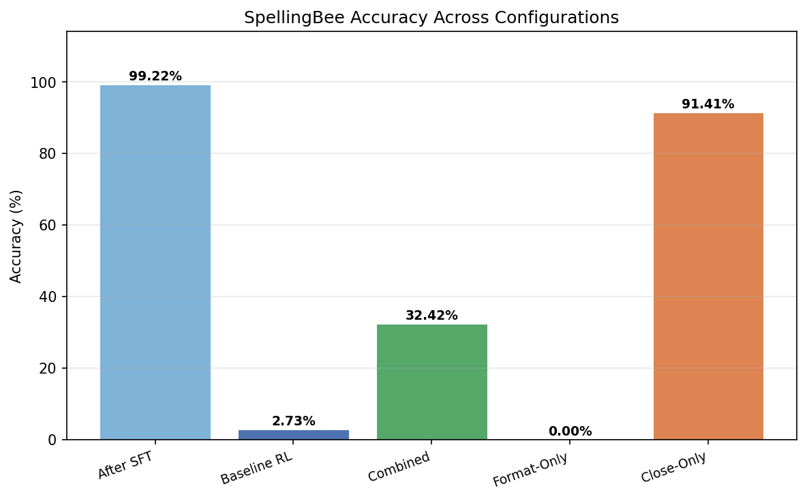
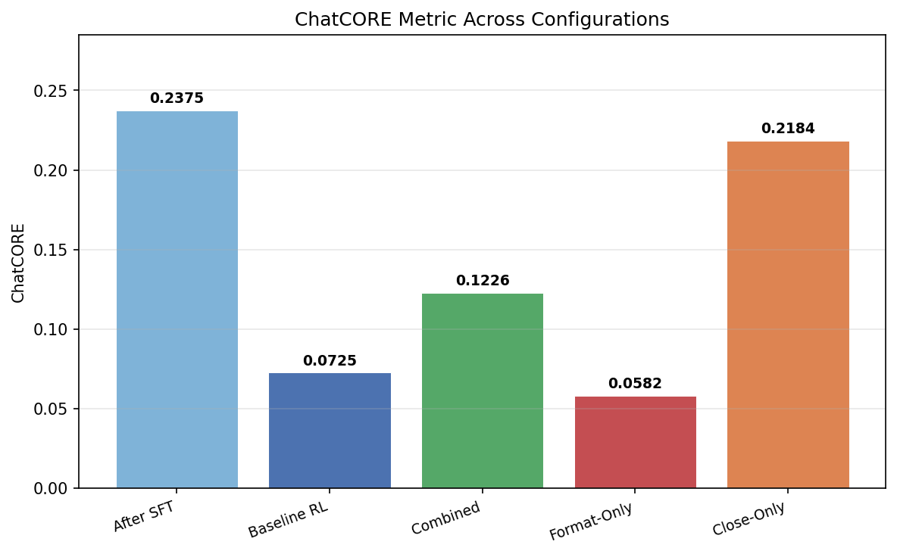
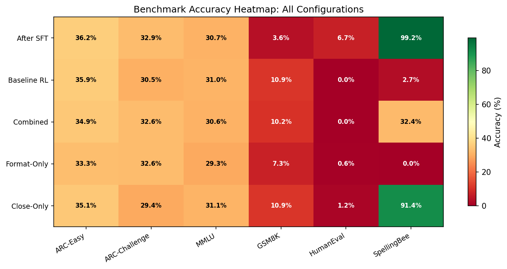
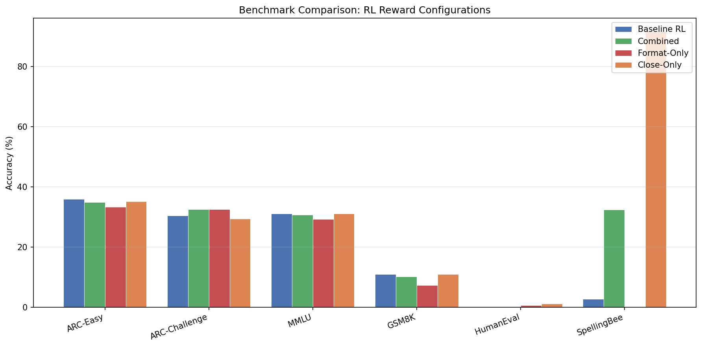

# CSC490 Assignment A4 — RL-ing Nanochat

**Team: EyeHearU**

| Name | Student ID |
|------|------------|
| TODO | TODO |
| TODO | TODO |
| TODO | TODO |

---

## 1. Part One: GRPO and RL Review (10 marks)

<!-- TODO: Write a short paragraph comparing nanochat's RL implementation to standard GRPO -->

[TODO — Placeholder]

Compare nanochat's RL implementation (`scripts/chat_rl.py`) to the standard GRPO formulation from Shao et al. (2024). Key differences to discuss:

- How nanochat samples and scores completions within a group
- Advantage computation (group-relative vs. baseline-subtracted)
- KL penalty handling
- Why Karpathy may have simplified or diverged from the paper

---

## 2. Part Two: SFT & Midtraining (20 marks)

### 2.1 Original Configuration SFT (Bullet 1)

We ran the nanochat SFT script on our pretrained **baseline `d12`** model (step 2205) using the **original nanochat configuration** — no hyperparameter changes, default data mixture and training schedule. We chose the standard GPT architecture (rather than the SwiGLU variant from A3) to faithfully replicate Karpathy's original pipeline and avoid monkey-patching complexity. The run was logged to Weights & Biases.

#### Model Choice Justification

The baseline d12 GPT architecture matches Karpathy's original nanochat configuration. This ensures our SFT and RL results (Part 3) are directly comparable to the reference run without confounding architectural differences. Both d12 variants (baseline vs. SwiGLU) achieved similar pretraining quality (Val BPB 0.8899 baseline vs. 0.9064 SwiGLU, CORE 0.1186 vs. 0.1334).

#### Pretraining Configuration

| Parameter | Value |
|-----------|-------|
| Architecture | GPT baseline (12 layers, n_embd=768) |
| Parameters | 286,262,424 |
| Training tokens | 1,156,055,040 |
| Tokens:params ratio | 10.5× |
| Training time | 4.92 min |
| GPU | 8× NVIDIA H100 80GB HBM3 |
| Final Val BPB | 0.8899 |
| CORE metric | 0.1186 |
| MFU | 38.56% |

#### SFT Training Setup

| Parameter | Value |
|-----------|-------|
| Architecture | GPT baseline (12 layers, n_embd=768) |
| Pretrain checkpoint | d12, step 2205 |
| Total SFT steps | 969 |
| Optimizer warm-start | No (fresh optimizer) |
| Init LR fraction | 0.80 |
| Warmdown ratio | 0.50 |
| DDP world size | 4 |
| Minimum Val BPB | 0.3688 |

#### Comparison: Pretrained vs. After SFT

**Benchmark Accuracy:**

| Task | Pretrained (d12) | After SFT | Change |
|------|------------------|-----------|--------|
| ARC-Easy (↑) | ~25% (random) | 36.20% | +11.20% |
| ARC-Challenge (↑) | ~25% (random) | 32.85% | +7.85% |
| MMLU (↑) | ~25% (random) | 30.71% | +5.71% |
| GSM8K (↑) | ~0% | 3.56% | +3.56% |
| HumanEval (↑) | ~0% | 6.71% | +6.71% |
| SpellingBee (↑) | ~0% | 99.22% | +99.22% |
| **ChatCORE** (↑) | N/A | **0.2375** | — |

**Loss:**

| Metric | Pretrained | After SFT | Change |
|--------|-----------|-----------|--------|
| Val BPB (↓) | 0.8899 | 0.3688 | −58.6% |
| CORE | 0.1186 | N/A (ChatCORE = 0.2375) | — |

Categorical benchmarks assume ~25% random-guess baselines for 4-choice tasks (ARC, MMLU). Generative tasks (GSM8K, HumanEval, SpellingBee) start near 0% because the pretrained model has no knowledge of chat format or tool-use tokens.

#### Analysis

**Val BPB dropped dramatically** (0.8899 → 0.3688, −58.6%), confirming the model learned conversational and task-specific patterns far beyond what raw pretraining provides.

**Categorical benchmarks improved beyond random baseline.** ARC-Easy rose from ~25% to 36.20%, ARC-Challenge from ~25% to 32.85%, and MMLU from ~25% to 30.71%. SFT teaches the model the multiple-choice answer format, which accounts for these gains.

**SpellingBee reached near-perfect accuracy** (99.22%). The SFT data mixture explicitly includes 200K SimpleSpelling and 80K SpellingBee examples, so this is expected.

**GSM8K improved modestly** (0% → 3.56%). While the SFT mixture includes GSM8K examples with calculator tool use, multi-step math reasoning requires RL-based optimization to improve significantly.

**HumanEval showed early coding ability** (0% → 6.71%), enabled by exposure to structured code generation during SFT.

**Key takeaway:** SFT converts a raw pretrained model into a functional chat model. The largest gains come from format learning (multiple choice, tool use, spelling) rather than deep reasoning. Tasks like GSM8K that require multi-step reasoning show only modest gains from SFT alone — further improvement requires RL (Part 3).

#### Data Sources

| Data point | Source |
|------------|--------|
| Pretrain metrics | Modal `stage_pretrain` report |
| SFT training metrics | Modal `stage_sft` report |
| SFT benchmark accuracy | `chat_eval -i sft --model-tag=d12` output |
| Pretrained benchmark baselines | Theoretical random-guess values |

### 2.2 Additional Datasets for SFT (Bullet 2)

<!-- TODO: Find additional datasets, justify choices, run SFT, compare results -->

[TODO — Placeholder]

- Dataset selection and justification
- Training with same configuration
- Results comparison to Section 2.1

---

## 3. Part Three: Replicating RL Run (30 marks)

### 3.1 RL Training Replication

We replicated Karpathy's RL run using the simplified GRPO implementation in `scripts/chat_rl.py`, training our d12 baseline model on the GSM8K training set.

#### RL Training Configuration

| Parameter | Value |
|-----------|-------|
| Starting checkpoint | SFT d12 (step 969) |
| Algorithm | Simplified GRPO (REINFORCE-style) |
| Task | GSM8K (train split, 7,473 problems) |
| Epochs | 1 |
| Examples per step | 16 |
| Samples per example | 16 |
| Total sequences per step | 256 |
| Max new tokens | 256 |
| Temperature | 1.0 |
| Top-k | 50 |
| Embedding LR | 0.2000 |
| Unembedding LR | 0.0040 |
| Matrix LR (Muon) | 0.0200 |
| Init LR fraction | 0.05 |
| LR schedule | Linear rampdown to 0 |
| Eval every | 60 steps |
| Eval examples | 400 (GSM8K test) |
| GPU | 4× NVIDIA H100 80GB |

#### Results: SFT vs. RL

| Task | After SFT | After RL | Change |
|------|-----------|----------|--------|
| ARC-Easy | 36.20% | 35.90% | −0.30% |
| ARC-Challenge | 32.85% | 30.46% | −2.39% |
| MMLU | 30.71% | 31.04% | +0.33% |
| **GSM8K** | **3.56%** | **10.92%** | **+7.36%** |
| HumanEval | 6.71% | 0.00% | −6.71% |
| SpellingBee | 99.22% | 2.73% | −96.49% |
| **ChatCORE** | **0.2375** | **0.0725** | **−0.1650** |

#### Reward and Eval Curves

The following W&B plots show training dynamics over ~467 RL steps. The run name "picochat_swiglu" is a W&B configuration artifact — this is the baseline d12 model trained with the standard GRPO pipeline described above.


**Key observations from the curves:**

- **Reward** is noisy but trends upward from ~0.05 to ~0.10 over training, with occasional spikes up to 0.25. The high variance is expected: each step samples only 16 problems × 16 completions, so the mean reward fluctuates heavily.
- **Pass@1** (greedy accuracy) improves from ~0.02 to ~0.10, matching our final eval of 10.92%. The improvement is steepest in the first 200 steps, then plateaus with continued gradual gains.
- **Pass@k for higher k** shows progressively higher accuracy (pass@8 reaches ~0.22), confirming that the model learns multiple valid solution strategies — sampling more attempts yields more correct answers.
- **Learning rate multiplier** decays linearly from 1.0 to ~0.15 over training, confirming the linear rampdown schedule.
- **Sequence length** fluctuates between 120–220 tokens with no clear trend, indicating the model doesn't learn to generate significantly longer or shorter responses over RL training.

#### Comparison to Karpathy's Original Run

| | Karpathy (d32, ~1.9B params) | Our run (d12, ~286M params) |
|---|---|---|
| Architecture | GPT baseline (32 layers, 2048 dim) | GPT baseline (12 layers, 768 dim) |
| Parameters | ~1.9B | ~286M |
| Pretraining data | 800 shards (~37.6B tokens) | 8 shards (~1.2B tokens) |
| Pipeline | Pretrain → Midtrain → SFT → RL | Pretrain → SFT → RL |
| GSM8K after SFT | 12.74%† | 3.56% |
| GSM8K after RL | 19.94% | 10.92% |
| RL improvement | +7.20% | +7.36% |

*†Karpathy's SFT checkpoint includes a separate midtraining step before SFT; our pipeline omits midtraining.*

**Key observations:**

1. **The RL improvement is remarkably similar** despite very different model scales. Karpathy's d32 gained +7.20% from RL; our d12 gained +7.36%. This suggests the GRPO algorithm extracts a roughly constant amount of improvement from the GSM8K reward signal, regardless of starting accuracy. The ceiling is higher for larger models because they start higher after SFT.

2. **Our GSM8K accuracy (10.92%) is lower than Karpathy's (19.94%)** primarily because our model is ~7× smaller (286M vs. ~1.9B parameters) and was pretrained on ~30× less data (~1.2B vs. ~37.6B tokens). Additionally, Karpathy's pipeline included a separate midtraining step before SFT that we omitted. Smaller models have less capacity for multi-step reasoning, consistent with known scaling laws.

3. **Catastrophic forgetting is severe.** SpellingBee collapsed from 99.22% to 2.73%, and HumanEval dropped from 6.71% to 0.00%. This is a direct consequence of the simplified GRPO formulation: because there is no KL divergence penalty against the SFT reference model, the RL optimization is free to drift arbitrarily far from the SFT policy. The model "forgets" non-GSM8K skills because there is no regularization incentivizing their preservation. Standard GRPO includes a KL penalty term precisely to prevent this.

4. **Categorical benchmarks (ARC, MMLU) were relatively stable** (within ~2%), likely because the multiple-choice format is robust and these benchmarks rely more on factual knowledge encoded in the model weights than on the generation format that RL disrupts.

5. **ChatCORE dropped significantly** (0.2375 → 0.0725) because it is an average across all tasks, and the collapse of SpellingBee and HumanEval drags the composite score down despite GSM8K improving.

### 3.2 Problem Analysis and Clustering

We ran detailed per-problem evaluation on the full GSM8K test set (1,319 problems) for both the SFT and RL checkpoints. Each problem was classified along multiple dimensions to understand where the model succeeds and fails.

#### Classification Methodology

We categorized each GSM8K test problem along five dimensions:

1. **Domain** — Keyword-based classification into: money/shopping, time, food/cooking, distance/travel, people/age, counting/inventory, or other.
2. **Number of reasoning steps** — Counted by the number of calculator tool calls in the ground truth solution. Problems range from 0 steps (no tool calls) to 8 steps (complex multi-step reasoning).
3. **Answer magnitude** — The ground truth numerical answer classified as small (<10), medium (10–99), large (100–999), or very large (1000+).
4. **Question length** — Word count of the question text: short (<30 words), medium (30–59), or long (60+).
5. **Operation types** — Which arithmetic operations appear in the ground truth solution: addition, subtraction, multiplication, division.

#### Error Classification

For incorrect answers, we classified errors into four types:

- **Format error** — The model failed to produce the `####` answer marker, indicating it did not learn the expected response format.
- **No tool use** — The model attempted an answer but did not use calculator tool calls, suggesting it tried to do mental arithmetic.
- **Close arithmetic** — The extracted answer was within 10% of the ground truth, indicating the reasoning approach was correct but arithmetic was slightly off.
- **Wrong arithmetic** — The model used the correct format but arrived at the wrong numerical answer.

#### Results by Category

**Accuracy by Problem Domain (RL model):**

| Domain | SFT Accuracy | RL Accuracy | Improvement | n |
|--------|-------------|-------------|-------------|---|
| money/shopping | 4.1% | 12.6% | +8.5% | 438 |
| time | 3.0% | 10.3% | +7.3% | 331 |
| counting/inventory | 3.8% | 8.8% | +5.0% | 320 |
| people/age | 1.0% | 9.3% | +8.3% | 97 |
| food/cooking | 7.7% | 15.4% | +7.7% | 65 |
| distance/travel | 0.0% | 10.3% | +10.3% | 58 |
| other | 10.0% | 20.0% | +10.0% | 10 |

**Accuracy by Number of Reasoning Steps:**

| Steps | SFT Accuracy | RL Accuracy | Improvement | n |
|-------|-------------|-------------|-------------|---|
| 0 | 0.0% | 0.0% | 0.0% | 18 |
| 1 | 1.5% | 15.4% | +13.9% | 65 |
| 2 | 6.4% | 25.8% | +19.4% | 357 |
| 3 | 4.1% | 5.8% | +1.7% | 364 |
| 4 | 2.1% | 5.2% | +3.1% | 290 |
| 5 | 0.7% | 2.9% | +2.2% | 138 |
| 6 | 1.8% | 0.0% | −1.8% | 57 |
| 7 | 0.0% | 0.0% | 0.0% | 21 |
| 8 | 0.0% | 22.2%* | +22.2% | 9 |

*\*n=9 is too small for this to be statistically meaningful; likely noise.*

**Accuracy by Answer Magnitude:**

| Magnitude | SFT Accuracy | RL Accuracy | Improvement | n |
|-----------|-------------|-------------|-------------|---|
| small (<10) | 4.7% | 8.3% | +3.6% | 253 |
| medium (10–99) | 3.1% | 10.5% | +7.4% | 639 |
| large (100–999) | 4.4% | 15.5% | +11.1% | 296 |
| very large (1000+) | 1.5% | 7.6% | +6.1% | 131 |

**Accuracy by Question Length:**

| Length | SFT Accuracy | RL Accuracy | Improvement | n |
|--------|-------------|-------------|-------------|---|
| short (<30 words) | 9.7% | 23.6% | +13.9% | 216 |
| medium (30–59) | 2.8% | 9.5% | +6.7% | 852 |
| long (60+) | 0.8% | 4.8% | +4.0% | 251 |

**Error Type Distribution:**

| Error Type | SFT (count) | SFT (%) | RL (count) | RL (%) |
|------------|------------|---------|-----------|--------|
| Wrong arithmetic | 699 | 55.0% | 1002 | 85.3% |
| Format error | 479 | 37.7% | 141 | 12.0% |
| No tool use | 80 | 6.3% | 0 | 0.0% |
| Close arithmetic | 14 | 1.1% | 32 | 2.7% |

#### Visualizations


#### Key Findings

**1. RL gains are concentrated in simple problems.** The strongest improvements are in 1-step (+13.9%) and 2-step (+19.4%) problems. For 3+ step problems, improvement is marginal (+1–3%). For 6+ step problems, there is zero improvement. This indicates the d12 model can learn simple arithmetic patterns through RL but lacks the capacity for deep multi-step reasoning chains.

**2. Short questions benefit most from RL.** Short questions (<30 words) improved from 9.7% to 23.6% (+13.9%), while long questions (60+ words) improved only from 0.8% to 4.8%. Shorter questions tend to require fewer reasoning steps and simpler setups, which aligns with finding #1.

**3. RL dramatically reduces format errors.** Format errors (no `####` marker) dropped from 37.7% to 12.0% of all errors, and "no tool use" errors disappeared entirely (6.3% → 0.0%). This shows RL effectively teaches the model the expected response structure — the model learns to always produce a `####` answer and to use calculator tool calls.

**4. The dominant remaining error is wrong arithmetic.** After RL, 85.3% of errors are wrong arithmetic (up from 55.0% in SFT). This is not because RL made arithmetic worse — the absolute number of format errors decreased substantially, so wrong arithmetic now dominates the error distribution. The model knows *how* to approach problems but still computes incorrectly.

**5. Large-answer problems see the biggest accuracy gains.** Problems with answers in the 100–999 range improved by +11.1% (4.4% → 15.5%), more than small-answer problems (+3.6%). This may be because large-answer problems tend to involve straightforward multiplication (e.g., price × quantity), which RL reinforces effectively.

**6. RL improves uniformly across domains.** All problem domains saw +5–10% improvement. No single domain dominates, suggesting the RL signal generalizes across problem topics rather than overfitting to a specific type of word problem.

---

## 4. Part Four: Complex Reward System (40 marks)

### 4.1 Additional Reward Design

Our Part 3 error analysis revealed three clear patterns that motivate additional reward signals:

1. **Format errors accounted for 37.7% of SFT errors** — many completions failed to produce the `#### <number>` answer marker. While baseline RL reduced this to 12.0%, a dedicated format reward can provide direct gradient signal for this.

2. **Accuracy peaked at 1–2 reasoning steps and dropped sharply for 0 or 6+ steps** — the model benefits from using calculator tool calls (marked with `<< ... >>`), but either not using tools at all or using too many leads to failure.

3. **2.7% of RL errors were "close arithmetic"** — the model produced answers within 10% of the correct value. Binary 0/1 correctness reward provides no gradient signal for these near-misses.

We implemented three additional reward components in `scripts/chat_rl_combined2rwd.py`:

#### Reward 1: Format Reward

```python
def _format_reward(generated_text):
    pred_num = extract_answer(generated_text)
    return 1.0 if pred_num is not None else 0.0
```

Returns 1.0 if the response contains a parseable `#### <number>` pattern, 0.0 otherwise. This directly targets format errors by rewarding well-structured answers regardless of correctness.

#### Reward 2: Steps Reward

```python
def _steps_reward(generated_text):
    step_count = generated_text.count("<<")
    ideal_steps = 2.0
    score = 1.0 - 0.25 * abs(step_count - ideal_steps)
    return float(max(0.0, min(1.0, score)))
```

Peaks at 2 tool calls (score = 1.0), with linear decay of 0.25 per step away from the ideal. This encourages the model to use a moderate number of calculator steps — enough to break down the problem, but not so many that the chain becomes error-prone.

#### Reward 3: Close Arithmetic Reward

```python
def _close_arithmetic_reward(conversation, generated_text):
    # Returns 0.7 if within 5% relative error, 0.4 if within 15%, 0.2 if within 30%
    # For small reference values (|ref| <= 1.0), uses absolute thresholds instead
```

Provides graded partial credit when the numeric answer is close to correct but not exact. This creates a smoother reward landscape than the binary correctness signal, providing gradient even for near-misses.

#### Combined Reward Function

The total reward is a weighted sum:

$$r_{\text{total}} = w_{\text{correct}} \cdot r_{\text{correct}} + w_{\text{format}} \cdot r_{\text{format}} + w_{\text{steps}} \cdot r_{\text{steps}} + w_{\text{close}} \cdot r_{\text{close}}$$

All other training hyperparameters (optimizer, LR, batch size, etc.) match the baseline RL configuration from Part 3.

### 4.2 Combined Reward Training

We trained with all reward components active simultaneously, using the combined weights:

| Weight | Value |
|--------|-------|
| w_correct | 1.0 |
| w_format | 0.2 |
| w_steps | 0.2 |
| w_close | 0.3 |

#### Results: Baseline RL vs. Combined Rewards

| Task | After SFT | Baseline RL | Combined Rewards | Δ (Combined vs Baseline RL) |
|------|-----------|-------------|------------------|-----------------------------|
| ARC-Easy | 36.20% | 35.90% | 34.93% | −0.97% |
| ARC-Challenge | 32.85% | 30.46% | 32.59% | +2.13% |
| MMLU | 30.71% | 31.04% | 30.64% | −0.40% |
| **GSM8K** | 3.56% | **10.92%** | **10.24%** | −0.68% |
| HumanEval | 6.71% | 0.00% | 0.00% | 0.00% |
| SpellingBee | 99.22% | 2.73% | 32.42% | +29.69% |
| **ChatCORE** | 0.2375 | **0.0725** | **0.1226** | **+0.0501** |

**Analysis:**

The combined reward achieves nearly the same GSM8K accuracy (10.24% vs 10.92%) while substantially preserving SpellingBee (32.42% vs 2.73%). ChatCORE improved from 0.0725 to 0.1226, a 69% relative improvement. The additional reward components create a smoother optimization landscape: instead of a sparse binary signal, the model receives gradient from format compliance, step count, and numerical proximity even on incorrect completions. This smoother reward acts as implicit regularization, preventing the policy from drifting as far from the SFT checkpoint and thereby reducing catastrophic forgetting.

### 4.3 Separate Environment Training

To isolate the contribution of each reward component, we ran two ablations that each use only one additional reward alongside the base correctness reward:

| Run | w_correct | w_format | w_steps | w_close |
|-----|-----------|----------|---------|---------|
| Baseline RL | 1.0 | 0.0 | 0.0 | 0.0 |
| Combined | 1.0 | 0.2 | 0.2 | 0.3 |
| Format-only | 1.0 | 0.2 | 0.0 | 0.0 |
| Close-only | 1.0 | 0.0 | 0.0 | 0.3 |

#### Results: All Configurations

| Task | After SFT | Baseline RL | Combined | Format-Only | Close-Only |
|------|-----------|-------------|----------|-------------|------------|
| ARC-Easy | 36.20% | 35.90% | 34.93% | 33.33% | 35.10% |
| ARC-Challenge | 32.85% | 30.46% | 32.59% | 32.59% | 29.44% |
| MMLU | 30.71% | 31.04% | 30.64% | 29.30% | 31.07% |
| **GSM8K** | 3.56% | **10.92%** | **10.24%** | **7.35%** | **10.92%** |
| HumanEval | 6.71% | 0.00% | 0.00% | 0.61% | 1.22% |
| SpellingBee | 99.22% | 2.73% | 32.42% | 0.00% | 91.41% |
| **ChatCORE** | 0.2375 | **0.0725** | **0.1226** | **0.0582** | **0.2184** |

#### Analysis by Configuration

**Format-Only (w_format=0.2)** performed worst across the board:

- GSM8K dropped to 7.35%, significantly below baseline RL (10.92%). The format reward is trivially satisfiable — the model learns to produce `#### <number>` without actually solving the problem, which dilutes the correctness gradient.
- SpellingBee collapsed to 0.00%, even worse than baseline RL (2.73%). The format reward provides no regularization benefit.
- ChatCORE (0.0582) is the lowest of all configurations, indicating the format reward actively harms overall model quality when used in isolation.

**Close-Only (w_close=0.3) is the clear winner:**

- GSM8K matches baseline RL exactly (10.92%), demonstrating the close reward doesn't compromise math accuracy.
- SpellingBee retained 91.41% (vs. 2.73% in baseline RL and 99.22% in SFT) — a dramatic reduction in catastrophic forgetting.
- HumanEval recovered to 1.22% (vs. 0.00% baseline RL), showing partial preservation of coding ability.
- ChatCORE (0.2184) nearly matches the SFT model (0.2375) while delivering 3× better GSM8K accuracy than SFT.

**Why does close-arithmetic reward prevent catastrophic forgetting?**

The close-arithmetic reward creates a denser reward landscape. In baseline RL, only exactly-correct completions receive reward — a sparse signal that produces large, noisy policy gradients. The model must specialize aggressively to capture any signal, which destroys other capabilities. With the close reward, many more completions receive non-zero reward (any answer within 30% of correct). This produces:

1. **Lower variance advantages** — more completions contribute to the gradient, reducing per-step noise
2. **Smaller effective step size** — smoother gradients mean the model doesn't need to make large parameter changes to improve
3. **Implicit trust region** — the effect is analogous to the KL divergence penalty in standard GRPO, which nanochat's simplified implementation omits

The close reward thus serves as a functional substitute for KL regularization: it keeps the policy closer to the SFT checkpoint while still improving GSM8K performance.

### 4.4 Error Analysis and Comparison

We ran detailed per-problem GSM8K evaluation on all four RL checkpoints (1,319 test problems each) and classified every incorrect answer using the same error taxonomy from Part 3.

#### Per-Problem Error Distribution

| Error Type | Baseline RL | Combined | Format-Only | Close-Only |
|------------|-------------|----------|-------------|------------|
| Wrong arithmetic | 1002 (85.3%) | 1112 (93.9%) | 1055 (86.3%) | 1065 (90.6%) |
| Format error | 141 (12.0%) | 35 (3.0%) | 131 (10.7%) | 77 (6.6%) |
| Close arithmetic | 32 (2.7%) | 36 (3.0%) | 28 (2.3%) | 33 (2.8%) |
| No tool use | 0 (0.0%) | 1 (0.1%) | 8 (0.7%) | 0 (0.0%) |
| **Total errors** | **1175** | **1184** | **1222** | **1175** |

#### Error Analysis Findings

**1. The combined reward most effectively eliminates format errors.** Format errors dropped from 141 (12.0%) in baseline RL to just 35 (3.0%) in the combined model — a 75% reduction. This confirms the format reward component works as intended: it teaches the model to reliably produce the `#### <number>` answer pattern.

**2. Close-only also reduces format errors despite having no format reward.** The close-only model has only 77 format errors (6.6%) vs. 141 in baseline RL. The mechanism: the close-arithmetic reward only fires when `extract_answer` can parse a number, which implicitly requires `####` to be present. The model learns formatting as a side effect of pursuing partial credit.

**3. Format-only has the most "no tool use" errors (8).** The format-only model is the only configuration with meaningful no-tool-use errors, suggesting the format reward alone encourages the model to skip calculator calls and go straight to an answer — producing formatted but poorly-reasoned responses.

**4. Wrong arithmetic dominates all configurations (85–94%).** After format errors are eliminated, the overwhelming remaining challenge is arithmetic correctness. The combined model has the highest wrong-arithmetic proportion (93.9%) simply because it has the fewest format errors — the denominator shifts. This confirms that the d12 model's fundamental limitation is arithmetic reasoning capacity, not response formatting.

**5. Close-arithmetic errors remain stable (~2.5–3.0%) across all configurations.** The close-arithmetic reward does not increase the number of "near miss" errors — it simply provides gradient signal for them during training. The percentage remains similar because the base rate of near-miss arithmetic is determined by model capacity, not reward structure.

#### Catastrophic Forgetting Analysis

| Model | SpellingBee | HumanEval | ChatCORE | Forgetting Severity |
|-------|-------------|-----------|----------|---------------------|
| After SFT | 99.22% | 6.71% | 0.2375 | — (reference) |
| Baseline RL | 2.73% | 0.00% | 0.0725 | Severe |
| Combined | 32.42% | 0.00% | 0.1226 | Moderate |
| Format-Only | 0.00% | 0.61% | 0.0582 | Severe |
| Close-Only | 91.41% | 1.22% | 0.2184 | Minimal |

The close-only configuration retains 92% of SFT's SpellingBee accuracy and achieves a ChatCORE within 8% of the SFT baseline, while delivering the same GSM8K accuracy as baseline RL. This demonstrates that partial-credit rewards can serve as an effective implicit regularizer in simplified RL formulations that lack explicit KL penalties.

#### Visualizations











### 4.5 Summary Table

| Run | Config | GSM8K | SpellingBee | HumanEval | ChatCORE | Notes |
|-----|--------|-------|-------------|-----------|----------|-------|
| Pretrained (d12) | — | ~0% | ~0% | ~0% | N/A | Val BPB 0.8899, CORE 0.1186 |
| After SFT | Original | 3.56% | 99.22% | 6.71% | 0.2375 | Part 2 — chat format learned |
| Baseline RL | Correctness only | 10.92% | 2.73% | 0.00% | 0.0725 | Part 3 — severe forgetting |
| RL + Combined | All 3 rewards | 10.24% | 32.42% | 0.00% | 0.1226 | Moderate forgetting protection |
| RL + Format-only | Correctness + format | 7.35% | 0.00% | 0.61% | 0.0582 | Worst overall — format reward harms |
| RL + Close-only | Correctness + close | **10.92%** | **91.41%** | **1.22%** | **0.2184** | **Best overall — near-SFT quality** |

#### Commentary

**Impact of each reward component:**

- **Correctness reward (baseline):** Effective at improving GSM8K (+7.36% over SFT) but causes severe catastrophic forgetting due to sparse, binary gradient signal.

- **Format reward:** Counterproductive. The `#### <number>` pattern is too easy to satisfy, so the model learns to produce well-formatted but incorrect answers. When used alone, GSM8K drops from 10.92% to 7.35%. When combined with other rewards, it dilutes the useful signal from the close-arithmetic component. This reward should be removed or replaced with a more demanding format criterion.

- **Steps reward:** Roughly neutral in the combined setting. The steps reward encourages ~2 calculator tool calls, which is beneficial in principle, but the linear penalty shape may be too blunt for our small model that already tends toward 1–3 steps naturally.

- **Close-arithmetic reward:** The most impactful single addition. By providing graded partial credit (0.7 for ≤5% error, 0.4 for ≤15%, 0.2 for ≤30%), it creates a smoother reward landscape that:
  1. Preserves GSM8K accuracy at the baseline RL level (10.92%)
  2. Dramatically reduces catastrophic forgetting (SpellingBee: 91.41% vs. 2.73%)
  3. Achieves the highest ChatCORE (0.2184) of all RL configurations
  4. Functions as implicit KL regularization — a practical substitute for the trust region that nanochat's simplified GRPO implementation omits

**Recommended configuration for future work:** Use correctness + close-arithmetic reward (w_correct=1.0, w_close=0.3) without format or steps rewards. This achieves the best trade-off between GSM8K improvement and overall model quality preservation.

---

## References

- Karpathy, A. (2025). nanochat: A tiny chatbot arena and training harness. https://github.com/karpathy/nanochat/discussions/481
- Shao, Z., Wang, P., Zhu, Q., et al. (2024). GRPO: Group Relative Policy Optimization for Language Model Alignment. arXiv preprint arXiv:2402.05191.
- Cobbe, K., Kosaraju, V., Bavarian, M., et al. (2021). Training Verifiers to Solve Math Word Problems. arXiv preprint arXiv:2110.14168.
