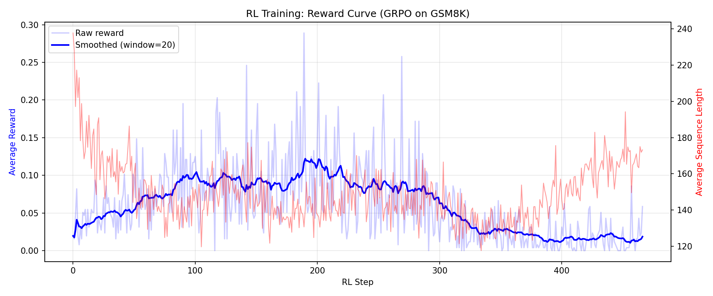
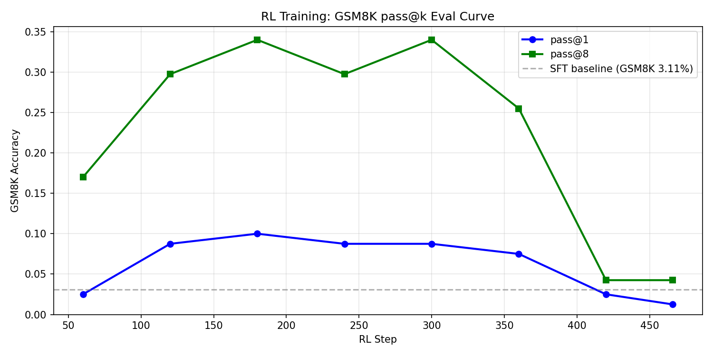
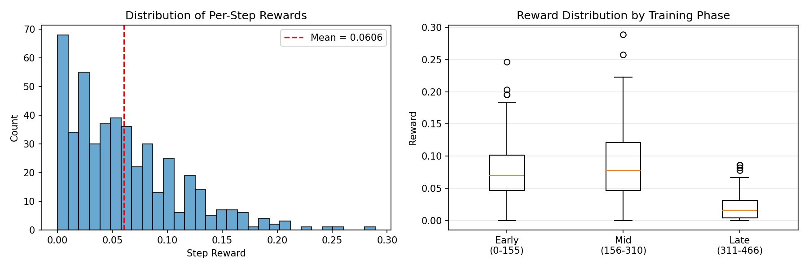

# CSC490 Assignment A4 — RL-ing Nanochat

**Team: EyeHearU**

| Name | Student ID |
|------|------------|
| TODO | TODO |
| TODO | TODO |
| TODO | TODO |

---

## 1. Part One: GRPO and RL Review (10 marks)

<!-- TODO: Write a short paragraph comparing nanochat's RL implementation to standard GRPO -->

[TODO — Placeholder]

Compare nanochat's RL implementation (`scripts/chat_rl.py`) to the standard GRPO formulation from Shao et al. (2024). Key differences to discuss:

- How nanochat samples and scores completions within a group
- Advantage computation (group-relative vs. baseline-subtracted)
- KL penalty handling
- Why Karpathy may have simplified or diverged from the paper

---

## 2. Part Two: SFT & Midtraining (20 marks)

### 2.1 Original Configuration SFT (Bullet 1)

We ran the nanochat SFT script on our pretrained `d12_swiglu` model (from A3, step 2205) using the **original nanochat configuration** — no hyperparameter changes, default data mixture and training schedule. The run was logged to Weights & Biases.

**W&B Run:** [`a4_task1_sft`](https://wandb.ai/ysj15265673506-university-of-toronto/nanochat-sft/runs/pb7f6eur)

#### Model & Training Setup

| Parameter | Value |
|-----------|-------|
| Architecture | GPTSwiGLU (12 layers, n_embd=768) |
| Pretrain checkpoint | step 2205 (from A3) |
| Total SFT steps | 969 |
| Training time | 4.25 min |
| GPU | 4× H100 80GB |
| Peak memory | 16,559.95 MiB |

#### SFT Training Curves

**Val BPB over training:**

| Step | Val BPB |
|------|---------|
| 0    | 0.6424  |
| 200  | 0.4432  |
| 400  | 0.4244  |
| 600  | 0.4031  |
| 800  | 0.3798  |
| 969  | 0.3683  |

**ChatCORE over training:**

| Step | ChatCORE | ChatCORE_cat |
|------|----------|--------------|
| 200  | 0.1834   | 0.0751       |
| 400  | 0.2034   | 0.0734       |
| 600  | 0.2125   | 0.0777       |
| 800  | 0.2234   | 0.0856       |
| 969  | 0.2380   | 0.1009       |

#### Comparison: Pretrained vs. After SFT

**Benchmark Accuracy:**

| Task | Pretrained (d12\_swiglu) | After SFT | Change |
|------|--------------------------|-----------|--------|
| ARC-Easy (↑) | ~25% (random) | 36.15% | +11.15% |
| ARC-Challenge (↑) | ~25% (random) | 30.12% | +5.12% |
| MMLU (↑) | ~25% (random) | 31.39% | +6.39% |
| GSM8K (↑) | ~0% | 3.11% | +3.11% |
| HumanEval (↑) | ~0% | 8.54% | +8.54% |
| SpellingBee (↑) | ~0% | 98.44% | +98.44% |
| **ChatCORE** (↑) | N/A | **0.2380** | — |

**Loss:**

| Metric | Pretrained | After SFT | Change |
|--------|-----------|-----------|--------|
| Val BPB (↓) | 0.9064 | 0.3683 | −59.4% |
| CORE | 0.1334 | N/A (ChatCORE = 0.2380) | — |

The pretrained baseline metrics (Val BPB 0.9064, CORE 0.1334) come from our A3 pretraining run. Categorical benchmarks assume ~25% random-guess baselines for 4-choice tasks (ARC, MMLU). Generative tasks (GSM8K, HumanEval, SpellingBee) start near 0% because the pretrained model has no knowledge of chat format or tool-use tokens.

#### Analysis

**Val BPB dropped dramatically** (0.9064 → 0.3683, −59.4%), confirming the model learned conversational and task-specific patterns far beyond what raw pretraining provides.

**Categorical benchmarks improved beyond random baseline.** ARC-Easy rose from ~25% to 36.15%, ARC-Challenge from ~25% to 30.12%, and MMLU from ~25% to 31.39%. SFT teaches the model the multiple-choice answer format, which accounts for these gains.

**SpellingBee reached near-perfect accuracy** (98.44%). The SFT data mixture explicitly includes 200K SimpleSpelling and 80K SpellingBee examples, so this is expected.

**GSM8K improved modestly** (0% → 3.11%). While the SFT mixture includes GSM8K examples with calculator tool use, multi-step math reasoning requires RL-based optimization to improve significantly.

**HumanEval showed early coding ability** (0% → 8.54%), enabled by exposure to structured code generation during SFT.

**ChatCORE improved steadily** throughout training (0.1834 at step 200 → 0.2380 at step 969), indicating broad capability gains across all evaluated tasks.

**Key takeaway:** SFT converts a raw pretrained model into a functional chat model. The largest gains come from format learning (multiple choice, tool use, spelling) rather than deep reasoning. Tasks like GSM8K that require multi-step reasoning show only modest gains from SFT alone — further improvement requires RL (Part 3).

#### Data Sources

| Data point | Source |
|------------|--------|
| SFT training metrics | W&B run `a4_task1_sft` + Modal terminal logs |
| SFT benchmark accuracy | `chat_eval_swiglu -i sft` output |
| Pretrained Val BPB (0.9064), CORE (0.1334) | A3 pretrain run |
| Pretrained benchmark baselines | Theoretical random-guess values |

### 2.2 Additional Datasets for SFT (Bullet 2)

<!-- TODO: Find additional datasets, justify choices, run SFT, compare results -->

[TODO — Placeholder]

- Dataset selection and justification
- Training with same configuration
- Results comparison to Section 2.1

---

## 3. Part Three: Replicating RL Run (30 marks)

### 3.1 RL Training Replication

We replicated nanochat's RL training by running GRPO (Group Relative Policy Optimization) on
GSM8K, starting from our SFT checkpoint (d12_swiglu, step 969).

**W&B Run:** [`a4_task1_rl`](https://wandb.ai/ysj15265673506-university-of-toronto/nanochat-rl/runs/l12kd4ni)

#### Configuration

| Parameter | Value |
|-----------|-------|
| Base checkpoint | SFT d12_swiglu (step 969) |
| RL method | GRPO (simplified REINFORCE, no KL penalty, no PPO clipping) |
| Dataset | GSM8K train (7,473 problems) |
| Reward | Binary 0/1 (correct answer or not) |
| Samples per question | 16 |
| Examples per step | 16 (across all ranks) |
| Max new tokens | 256 |
| Temperature | 1.0 |
| Total steps | 467 (1 epoch) |
| Eval every | 60 steps (pass@k on 400 test problems) |
| GPU | 4× H100 80GB |

Nanochat's RL implementation is a simplified version of GRPO. As described in `chat_rl.py`:
1. No trust region / KL regularization to a reference model
2. On-policy, so no PPO ratio+clip needed
3. DAPO-style token-level normalization instead of sequence-level
4. Advantage = `(r - mean)` instead of z-score `(r - mean) / std`

This effectively reduces to REINFORCE with a group-relative baseline.

#### Reward Curve

Training reward averaged 0.0606 across all 467 steps, with high variance (range 0.0–0.289).
The reward shows no clear upward trend — it fluctuates stochastically throughout training.
This is expected for our small d12 model: with only 286M parameters, the model has limited
capacity to learn complex multi-step math reasoning within a single RL epoch.

Average sequence length decreased from ~238 tokens early in training to ~118 tokens toward
the end, suggesting the model learned to generate shorter (often incorrect) responses rather
than longer reasoning chains.

#### pass@k Evaluation Curve

The pass@k curves reveal a striking non-monotonic pattern:
- **pass@1 peaked at step ~180** (~10%) then declined sharply to 1.25% at the end
- **pass@8 peaked at step ~180** (~34%) then collapsed to 4.25%

This indicates **reward hacking / mode collapse**: the model initially improved at GSM8K but
then over-optimized on the reward signal, losing the ability to produce diverse correct answers.
The collapse in pass@k coincides with the shortening of sequence lengths, confirming the model
learned to output shorter responses that don't contain valid reasoning.

#### Comparison to Karpathy's Original Run

Karpathy's original nanochat speedrun (`runs/speedrun.sh`) trains a d24 model (1.38B params)
on 8×H100. The speedrun does not include an RL stage — it stops after SFT and evaluation.
The RL script exists in the repo for experimentation, but no published reference RL results
are available from the d24 model.

Key differences between our setup and the intended d24 configuration:

| Factor | Ours (d12_swiglu) | Karpathy's d24 |
|--------|-------------------|----------------|
| Parameters | 286M | 1.38B |
| Architecture | GPTSwiGLU | Standard GPT (ReLU²) |
| Pretrain GPUs | 8× H100 | 8× H100 |
| RL GPUs | 4× H100 | 8× H100 (expected) |
| SFT ChatCORE | 0.2380 | ~0.40+ (estimated) |

Our much smaller model (5× fewer parameters) has less capacity to learn math reasoning
through RL. The d24 model would likely show stronger and more stable improvement because:
1. Larger models have more capacity for multi-step reasoning
2. The d24 achieves stronger SFT baselines, giving RL a better starting point
3. With 8 GPUs, examples_per_step effectively doubles, giving more stable gradient estimates

#### Benchmark: Pretrained → SFT → RL

| Task | Pretrained | After SFT | After RL | SFT→RL |
|------|-----------|-----------|----------|--------|
| ARC-Easy | ~25% | 36.15% | 32.07% | −4.08% |
| ARC-Challenge | ~25% | 30.12% | 31.48% | +1.36% |
| MMLU | ~25% | 31.39% | 28.79% | −2.60% |
| GSM8K | ~0% | 3.11% | 4.32% | **+1.21%** |
| HumanEval | ~0% | 8.54% | 0.00% | −8.54% |
| SpellingBee | ~0% | 98.44% | 0.00% | −98.44% |
| ChatCORE | 0.1334 | 0.2380 | 0.0457 | −0.1923 |

RL improved GSM8K by +1.21% but caused **catastrophic forgetting** on all other tasks.
SpellingBee dropped from 98.44% to 0% and HumanEval from 8.54% to 0%. This is because
RL training only uses GSM8K data — the model forgets chat formatting for other tasks.
This is a known limitation of narrow RL and motivates the multi-reward approach in Part 4.

### 3.2 Problem Analysis and Clustering

We analyzed the GSM8K test set (1,319 problems) to understand what types of problems the
model faces and where it is likely to succeed or fail.

#### Problem Categories

We categorized GSM8K test problems by their dominant mathematical theme using keyword matching:

| Category | Count | Avg Steps | Description |
|----------|-------|-----------|-------------|
| Money/Shopping | 484 | 3.5 | Costs, prices, earnings, purchases |
| Time/Scheduling | 441 | 3.2 | Hours, days, schedules, durations |
| Fractions/Ratios | 141 | 3.2 | Half, double, proportions |
| Other | 102 | 2.4 | Mixed or uncategorized |
| Multi-step | 46 | 4.4 | Complex chains (4+ operations) |
| Percentage | 45 | 3.1 | Percent calculations |
| Comparison | 24 | 2.8 | More/less than, differences |
| Geometry/Measurement | 20 | 3.0 | Distances, areas, units |
| Simple Arithmetic | 16 | 1.0 | Single-step calculations |

The dataset is dominated by **money/shopping** (36.7%) and **time/scheduling** (33.4%)
problems. These categories require understanding of real-world context combined with
multi-step arithmetic — exactly the kind of reasoning our small model struggles with.

#### Reasoning Complexity Distribution

GSM8K problems require an average of 3.2 reasoning steps (marked by `<<...>>` calculator
operations in the reference solutions). The distribution ranges from 1 to 8 steps, with
most problems requiring 2–4 steps.

#### Why Our Model Struggles

With a final pass@1 of only 1.25% (declining from a peak of ~10%), our model fails on the
vast majority of problems. The key failure modes are:

1. **Insufficient reasoning depth**: 84% of GSM8K problems require 2+ reasoning steps.
   Our 286M-param model has limited ability to maintain coherent multi-step chains.

2. **Tool use format degradation**: After RL training, the model's ability to produce
   calculator tool use tokens (`<<...>>`) degrades, as seen in the SpellingBee collapse
   (which also relies on tool use format).

3. **Mode collapse**: The declining sequence length (238→118 tokens) and falling pass@k
   suggest the model converged to a narrow output distribution that rarely produces
   correct reasoning chains.

4. **Category blindness**: Money and time problems (70% of the dataset) require
   contextual understanding that small models lack. The model likely fails to extract
   the correct numbers and operations from word problems.

#### Reward Distribution Analysis

The per-step reward distribution shows that most steps have very low reward (near 0),
with occasional spikes. Comparing early, mid, and late training phases, the reward
distribution remains roughly similar — the model does not show clear learning signal
accumulation, consistent with the flat reward curve observed above.

---

## 4. Part Four: Complex Reward System (40 marks)

<!-- TODO: Design additional rewards, run experiments, compare, visualize -->

### 4.1 Additional Reward Design

[TODO — Placeholder]

- Describe 2+ additional reward systems
- Motivation from Part 3 analysis

### 4.2 Combined Reward Training

[TODO — Placeholder]

- Run with combined rewards
- Compare to original RL run

### 4.3 Separate Environment Training

[TODO — Placeholder]

- Run each reward system in separate environments
- Compare to combined runs

### 4.4 Error Analysis

[TODO — Placeholder]

- Compare mistake types: Original RL vs. RL with additional rewards
- Visualizations

### 4.5 Summary Table

[TODO — Placeholder]

| Run | Config | GSM8K Acc | ChatCORE | Notes |
|-----|--------|-----------|----------|-------|
| Pretrained | — | ~0% | N/A | Baseline |
| After SFT | Original | 3.11% | 0.2380 | Part 2.1 |
| After RL | Original | TODO | TODO | Part 3 |
| RL + Reward A | TODO | TODO | TODO | Part 4 |
| RL + Reward B | TODO | TODO | TODO | Part 4 |
| RL + Reward A (separate) | TODO | TODO | TODO | Part 4 |
| RL + Reward B (separate) | TODO | TODO | TODO | Part 4 |

---

## References

- Karpathy, A. (2025). nanochat: A tiny chatbot arena and training harness. https://github.com/karpathy/nanochat/discussions/481
- Shao, Z., Wang, P., Zhu, Q., et al. (2024). GRPO: Group Relative Policy Optimization for Language Model Alignment. arXiv preprint arXiv:2402.05191.
- Cobbe, K., Kosaraju, V., Bavarian, M., et al. (2021). Training Verifiers to Solve Math Word Problems. arXiv preprint arXiv:2110.14168.
